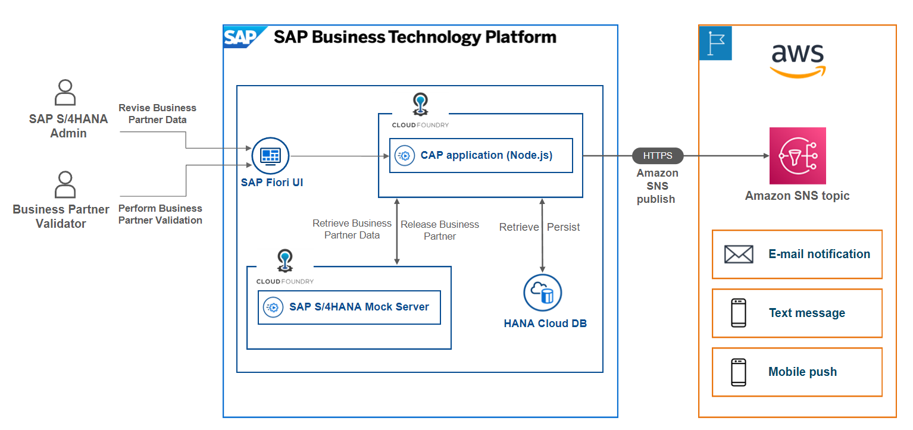

# Build SAP CAP Application and Integrate with Amazon SNS Service for Notifications

> **IMPORTANT**: This section is for informational purposes only and does not require any actions to be taken by the participants. Its aim is to provide a better understanding of the preconfigurations. The goal is to provide a clear understanding of the concepts and techniques involved, without the need for any hands-on implementation.

The objective of this exercise focuses on how to build a business application by using SAP Cloud Application Programming (CAP) to extend the SAP S/4HANA business process.

After you finish this exercise, you will successfully achieve the below objectives

- Have a basic understanding of the SAP Cloud Application Programming (CAP) module.
- Build your first backend service by using SAP CAP for SAP S/4HANA Business Partner manipulation and validation - purpose in Node.js
- Build your first frontend application by using Fiori Element UI for SAP S/4HANA Business Partner manipulation and validation purpose.
- Have a deep understanding of connecting backend CAP service with frontend Fiori UI.

You can find the complete sample code of this exercise here.

## Overview - What You Will Build

During this exercise, we will be guiding you to build a Full-Stack application to extend the SAP S/4HANA Business Partner validation business process. 

We will build the backend service in SAP CAP with Node.js, persist the business partner data in the SAP HANA Database hosted in the SAP HANA Cloud and build the frontend application as the entry point of the entire system with SAP Fiori Elements UI.

You can use SAP S/4HANA Cloud or build a mock service in SAP BTP for this exercise. 

Once the SAP S/4HANA Admin has completed the changes, there will be an email notification sent out to the Business Partner Validator via the Amazon Simple Notification service. The Business Partner Validator could find the business partner ID from the email and jump to the Fiori UI by clicking the URL in the email to perform the validation. If everything looks good, then the Business Partner Validator could release the business partner in the Fiori UI, which will then get updated back to the SAP S/4HANA Mock Server.

## Summary

The goal of this introduction was to give a clear understanding of the concepts and techniques involved in creating a Resilient Applications on SAP BTP with Amazon Web Services.

Continue to - [Exercise 1.2 -  Extend a Business Process Using a CAP Application on SAP BTP](../ex1.2/README.md)
