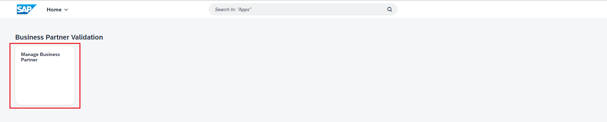
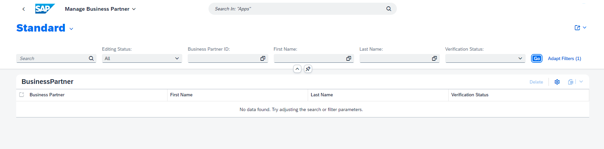
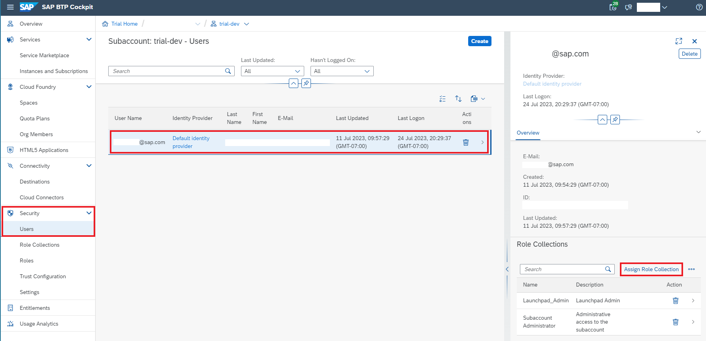
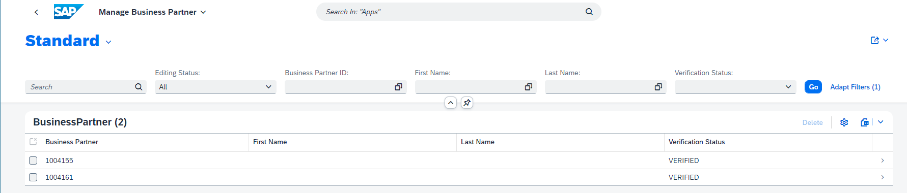

# Build SAP CAP Application and Integrate with Amazon SNS Service for Notification

>## Prerequistics 

- Access the mock server URL and check whether you can view the records for Business Partner.
- Check whether the HANA DB is up and running.
- Assign the roles for accessing SAP Business Application Studio. 
  
  Search for your user under **Security -> Users**. Click on **...** to select Assign Role Collection, search for **Business_Application_Studio** and assign all the roles to your user.

  

 
## Step 1 - Create a Business Partner Validation Application

In this section, you will focus on updating and deploying a Node.js CAP project in the Business Application Studio

1. 👉 Login into your SAP BTP subaccount. Click the **Instance and Subscriptions** on the left menu, and then click the **Go to Application** button of the SAP Business Application Studio service subscription. Click on the Default Identity Provider to log in to SAP BAS.

    

2. 👉 Create a Dev Space.

    

3. 👉 When it’s ready, open your dev space by clicking on the name. 

    


4. 👉 In the menu in SAP Business Application Studio, select **Terminal** → **New Terminal** and navigate to the projects folder using:

   ```bash
      cd projects
   ```

5. 👉 Clone the SAP CAP Application from the GitHub repository. 

   ```bash
      git clone https://github.com/alphageek7443/business-partner-validation
   ```

6. 👉 Choose **File** in the menu on the top and then select **Add Folder to Workspace** from the dropdown menu.

    

7. 👉 Open the project by choosing the **projects** → **business-partner-validation** and choose **Open**.

    

## Step 2- Consume S4-Mock-Server API by using Remote Service functionality provided by SAP CAP

In this section, we will introduce how to consume the external APIs by using the [Remote Service](https://cap.cloud.sap/docs/guides/using-services#introduction) functionality in the SAP CAP application.

> **Good to read**
>
> - [Consuming Services](https://cap.cloud.sap/docs/guides/using-services)
>
> The CAP runtimes for node.js not only supports consuming the service via [Axios](https://axios-http.com/docs/intro), Fetch API, but also provides you an easy functionlity, called [Remote Service](https://cap.cloud.sap/docs/guides/using-services#introduction) to consume the external CAP service or OData Service.

In this step, you will fetch the latest Business Partner data from the S4-Mock-Server by consuming the OP_API_BUSINESS_PARTNER_SRV API exposed by S4-Mock-Server application.

Note: For this exercise, we have deployed and created the destination for accessing the mock server.


1. 👉 Now let's define the S4-Mock-Server service endpoint, and install the required NPM packages so that we can consume the S4-Mock-Server in the CAP project successfully.

    Open the package.json file under the root directory of your CAP Project and update the code shown below under the **cds.requires.s4_mock_server**. 

    **Do not forget to replace the CHANGE-TO-YOUR-S4-Mocker-Server-Application-Endpoint with your real S4-Mocker-Server service endpoint.**

    You can get the endpoint URL from the destination. In your SAP BTP Cockpit, go to **Connectivity -> Destinations** and look for the **mockserver** destination to retrieve the URL.

    ```node.js
    "[sandbox]": {
        "credentials": {
            "url": "https://CHANGE-TO-YOUR-S4-Mocker-Server-Application-Endpoint/op-api-business-partner-srv"
        }
    },
    "[production]": {
        "credentials": {
            "url": "https://CHANGE-TO-YOUR-S4-Mocker-Server-Application-Endpoint/op-api-business-partner-srv"
        }
    }
    ```
    

## Step 3 - Build your Business Partner Validation Application

In this section, we will show you how to build and deploy your Business Partner Validation CAP project and Fiori UI Application to your SAP BTP subaccount as a Multi-Target Application (MTA)

> - Make sure the SAP HANA DB in the SAP BTP Account is up and running. 

1. 👉 **Right-click** on the **mta.yaml** file under your CAP project root directory, and then choose **Build MTA Project** from the menu.

    

2. 👉 Once the MTA Build process is successful, you will see the **build complete message** in your **terminal**. Also, there will be a **business-partner-validation_1.0.0.mtar** file generated under the **mta_archieve folder**.

    

## Step 4 - Deploy your Business Partner Validation Application in the SAP BTP Subaccount

1. 👉 Right click on the generated **business-partner-validation_1.0.0.mtar** file under the **mta_archieve** folder. Then select the **Deploy MTA Acchive** option from the menu. This will start the deployment process.

    

2. 👉 The **Cloud Foundry **Sign-In** and Targets**** page will be popping up. Choose the **Credentials** as the **Select authentication method**, then **enter the username and password you used to log in to the SAP BTP subaccount**. Click **Sign in**.

    

3. 👉 Select your SAP BTP subaccount and space, then click **Apply** to complete the sign-in. 

    

4. 👉 After you sign in successfully, the MTA deployment will be triggered. The deployment can take some minutes. After successful deployment, you will see the **Process finished** without any error statement in your terminal.

    

## Step 5- Verify the Deployment Result. 

1. 👉 Let's verify whether our backend CAP project is run and running on your SAP BTP subaccount. Issue the command **cf apps** in your terminal. 

    

You should see the **business-partner-validation-srv** is under the **started** status. 

2. 👉 The public endpoint of business-partner-validation-srv service will also display in the terminal. Copy the route of the business-partner-validation-srv service from your terminal and open it in the browser.

    

3. 👉 If you click on the **BusinessPartner**, **BusinessPartnerAddress** you will see the **401 Unauthorized** error. This means that the XSUAA deployment was also a success since we did not assign BusinessPartnerView or BusinessPartnerValidator role to us on the SAP BTP subaccount.

## Step 6- Setup Fiori UI Application in SAP Build WorkZone.

1. 👉 Go back to your SAP BTP  subaccount main page. Go to **Instance and Subscription**. Click the **Go to Application** button of the **SAP Build Work Zone, standard edition** service subscription.

    

2. 👉 Go to the **Channel Manager** and click the **update content** button of the **HTML5 Apps** channel.

    

3. 👉 Go to the **Content Manager**, switch to the **Content Explorer** tab and select the **HTML5 Apps**.

    

4. 👉 **Check** the **Manage Business Partner** application in the table, then click **+ Add to My Content** button.

    

5. 👉 Switch to the **My Content** tab. Let us create a new Group by clicking the **+ New** button, and selecting Group from the menu.

    

6. 👉 Give the **title** of the new Group as **Business Partner Validation**, then **assign the Manage Business Partner HTML5 App to this group**. Click **Save** to save the changes.

    

7. 👉 Go back to the My Content tab, then click on the Everyone role.

    

8. 👉 Click the **Edit** button, and **assign** the **Manage Business Partner HTML5 app** to this role. Click **Save** to save the changes.

    

9. 👉 Go to the **Site Directory**, then click the **+ Create Site** button to create a new site. 

    

10. 👉 Give the site name as** OpenSAP-AWS-Course-Week3**, then click **Create**.

11. 👉 Now let's try out our new site. Click the **Go to site**.

    

12. 👉 You can see the Business Partner Validation group that includes the Manage Business Partner apps. Open the Manage Business Partner app by clicking on it.

    

13. 👉 Now you have launched your Business Partner Validation app through the SAP Build Work Zone, standard edition successfully.

    

## Step 7- Assign Business Partner Viewer and Business Partner Validator Role on SAP BTP 

1. 👉 Go back to your SAP BTP subaccount main page. Go to **Security -> Users**. Click on the entry of your user, then click the **Assign Role Collection** button.

    

2. 👉 Search for **BusinessPartnerViewer-dev** and **BusinessPartnerValidator-dev** in the Assign Role Collection pop-up window's search bar. Click the **Assign Role Collection** button to assign these two roles to yourself.

    

## Step 8- Testing the Business Partner Validation App from End-to-End

1. 👉 Now go back to the **Manage Business Partner** app in the **SAP Build WorkZone**. Click the **Go** Button to view the Business Partner entry fetched from the S4-Mock-Server.

    

2. 👉 Click on the first entry in the table, and navigate to the Business Partner details page.

    

3. 👉 Since we already assigned the Business Partner Validtor role to ourselves, we can see the **Edit** and **Delete** buttons available to us. Let's start to update the Business Partner record by clicking the edit button.

    

4. 👉 Please update the Business Partner data as shown in the image below. After editing click the Save button to save the changes. 

    

> After this step, the updated data will persist to the SAP HANA Database only, but not update in the S4-Mock-Server yet.


5. 👉 Now let's click the Edit button again, **uncheck** the **Business Partner Central Blocked** check box, and change the **Verification Status** value to **V** by selecting it from the drop-down menu. Then Click the Save button to save the changes.

    

6. 👉 Now you will see that the updated ZipCode value 12345 has been persisted back to the S4-Mock-Server, and our application is working as desired. We are all set now.

## Congratulations!

Congratulations on completing your Exercise 1.1! You have successfully Extended a Business Process Using a CAP Application on SAP BTP!

Let's continue to - [Exercise 1.2 - Integrate the CAP Application with Amazon SNS](../ex1.2/README.md)

