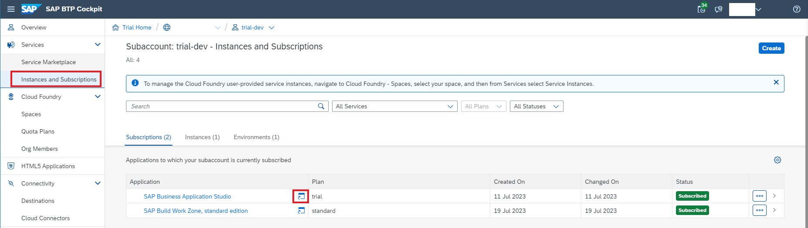

# Exercise 1.1 Extend a Business Process Using a CAP Application on SAP BTP

 
## Step 1 - Create a Business Partner Validation Application

In this section, you will focus on updating and deploying a Node.js CAP project in the Business Application Studio

1. Login to [SAP BTP Subaccount](https://emea.cockpit.btp.cloud.sap/cockpit/?idp=tdct3ched1.accounts.ondemand.com#/globalaccount/e2a835b0-3011-4c79-818a-d7767c4627cd/subaccount/70d96fca-b36b-4215-81c8-c263e090bea5/subaccountoverview).

2. 👉 Login into your SAP BTP subaccount. Click the **Instance and Subscriptions** on the left menu, and then click the **Go to Application** button of the SAP Business Application Studio service subscription. Click on the Default Identity Provider to log in to SAP BAS.

    

2. If you see this page. Login to the below highlighted IAS:

    


2. 👉 Create a Dev Space.

    

3. 👉 When it’s ready, open your dev space by clicking on the name. 

    


4. 👉 In the menu in SAP Business Application Studio, select **Terminal** → **New Terminal** and navigate to the projects folder using:

   ```bash
      cd projects
   ```

5. 👉 Clone the SAP CAP Application for Business Partner Validation from the GitHub repository. 

   ```bash
      git clone -b handson-code https://github.com/SAP-samples/teched2023-XP263.git
   ```

6. 👉 Choose **File** in the menu on the top and then select **Add Folder to Workspace** from the menu and click OK.
    
    `/home/user/projects/teched2023-XP263/`

    

7. 👉 Open the project by choosing the **projects** → **business-partner-validation** and choose **Open**.

    

8.  Open `manifest.json` file in `"app=>teched-aws-ui=>webapp"`. Update the below highlighted values from `"XX"` to `Your System ID - 01 or 02 or 40`.

    

9.  Open `mta.yaml` file and update the below highlighted values from `"XX"` to `Your System ID - 01 or 02 or 40`.

    

## Step 2- Consume S4-Mock-Server API by using Remote Service functionality provided by SAP CAP

In this section, we will introduce how to consume the external APIs by using the [Remote Service](https://cap.cloud.sap/docs/guides/using-services#introduction) functionality in the SAP CAP application.

> **Good to read**
>
> - [Consuming Services](https://cap.cloud.sap/docs/guides/using-services)
>
> The CAP runtimes for node.js not only supports consuming the service via [Axios](https://axios-http.com/docs/intro), Fetch API, but also provides you an easy functionlity, called [Remote Service](https://cap.cloud.sap/docs/guides/using-services#introduction) to consume the external CAP service or OData Service.

In this step, you will fetch the latest Business Partner data from the S4-Mock-Server by consuming the OP_API_BUSINESS_PARTNER_SRV API exposed by S4-Mock-Server application.

Note: For this exercise, we have deployed and created the destination for accessing the mock server.


## Step 3 - Build your Business Partner Validation Application

In this section, we will show you how to build and deploy your Business Partner Validation CAP project and Fiori UI Application to your SAP BTP subaccount as a Multi-Target Application (MTA)

> - Make sure the SAP HANA DB in the SAP BTP Account is up and running. 

1. 👉 **Right-click** on the **mta.yaml** file under your CAP project root directory, and then choose **Build MTA Project** from the menu.

    

2. 👉 Once the MTA Build process is successful, you will see the **build complete message** in your **terminal**. Also, there will be a **business-partner-validation_1.0.0.mtar** file generated under the **mta_archieve folder**.

    

## Step 4 - Deploy your Business Partner Validation Application in the SAP BTP Subaccount

1. 👉 Right click on the generated **business-partner-validation_1.0.0.mtar** file under the **mta_archieve** folder. Then select the **Deploy MTA Acchive** option from the menu. This will start the deployment process.

    

2. 👉 The **Cloud Foundry **Sign-In** and Targets**** page will be popping up. Choose the **Credentials** as the **Select authentication method**, then **enter the username and select SSO Passcode**  and click the "Open a new broswer page..." link. 

   

3. Enter "tdct3ched1-platform" and choose "Sign in with alternative identity provider".

   

4. Click the copy button to save it to the clipboard and paste it in "SSO passcode". Click "Sign in".

   

   

5. Select the cloud foundry organization and space and click "Apply".

   

    

3. 👉 Select your SAP BTP subaccount and space, then click **Apply** to complete the sign-in. 

    

4. 👉 After you sign in successfully, the MTA deployment will be triggered. The deployment can take some minutes. After successful deployment, you will see the **Process finished** without any error statement in your terminal.

    

## Step 5- Verify the Deployment Result. 

1. 👉 Let's verify whether our backend CAP project is run and running on your SAP BTP subaccount. Issue the command **cf apps** in your terminal. 

    

You should see the **business-partner-validation-srv** is under the **started** status. 

2. 👉 The public endpoint of business-partner-validation-srv service will also display in the terminal. Copy the route of the business-partner-validation-srv service from your terminal and open it in the browser.

    

## Congratulations!

Congratulations on completing your Exercise 1.1! You have successfully deployed an SAP CAP Application in SAP BTP.

Let's continue to - [Exercise 1.2 - Setup Fiori UI Application in SAP Build Work Zone](../ex1.2/README.md)

