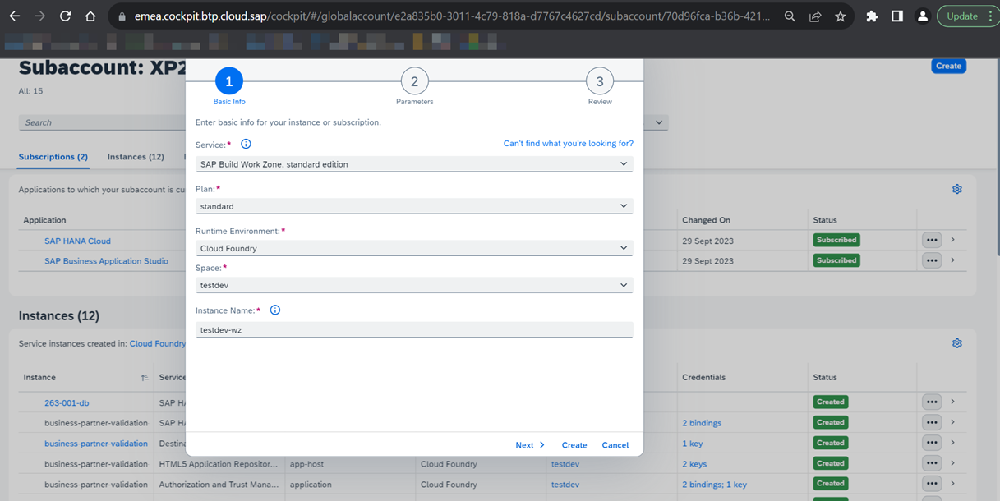
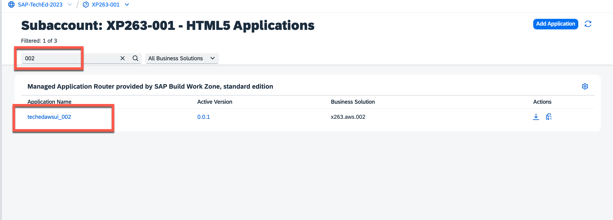

# Exercise 1.2 Test the deployed application.

<!--
## Step 1 - Setup the SAP Build Work Zone

1. 👉 Go back to your SAP BTP subaccount cockpit. Go to **Instance and Subscription**. Choose **Create** to add **SAP Build Work Zone, standard edition** as shown below. You should add for both Instance and Subscription.

    

    Click the **Go to Application** button of the **SAP Build Work Zone, standard edition** service subscription.

    

2. 👉 Go to the **Channel Manager** and click the **update content** button of the **HTML5 Apps** channel.

    

3. 👉 Go to the **Content Manager**, switch to the **Content Explorer** tab and select the **HTML5 Apps**.

    

4. 👉 **Check** the **Manage Business Partner** application in the table, then click **+ Add to My Content** button.

    

5. 👉 Switch to the **Content Manager** tab. Let us create a new Group by clicking the **+ New** button, and selecting Group from the menu.

    

6. 👉 Give the **title** of the new Group as **Business Partner Validation**, then **assign the Manage Business Partner HTML5 App to this group**. Click **Save** to save the changes.

    

7. 👉 Go back to the My Content tab, then click on the Everyone role.

    

8. 👉 Click the **Edit** button, and **assign** the **Manage Business Partner HTML5 app** to this role. Click **Save** to save the changes.

    

9. 👉 Go to the **Site Directory**, then click the **+ Create Site** button to create a new site. 

    

10. 👉 Give the site name as **TechEd-BTP-AWS** then click **Create**.

11. 👉 Now let's try out our new site. Click the **Go to site**.

    

12. 👉 You can see the Business Partner Validation group that includes the Manage Business Partner apps. Open the Manage Business Partner app by clicking on it.

    

13. 👉 Now you have launched your Business Partner Validation app through the SAP Build Work Zone, standard edition successfully.

    

## Step 2 - Assign Business Partner Viewer and Business Partner Validator Role on SAP BTP 

1. 👉 Go back to your SAP BTP subaccount main page. Go to **Security -> Users**. Click on the entry of your user, then click the **Assign Role Collection** button.

    

2. 👉 Search for **BusinessPartnerViewer-dev** and **BusinessPartnerValidator-dev** in the Assign Role Collection pop-up window's search bar. Click the **Assign Role Collection** button to assign these two roles to yourself.

    

## Step 3- Testing the Business Partner Validation App from End-to-End
-->

1.  Navigate to [HTML5 Applications](https://emea.cockpit.btp.cloud.sap/cockpit/?idp=tdct3ched1.accounts.ondemand.com#/globalaccount/e2a835b0-3011-4c79-818a-d7767c4627cd/subaccount/70d96fca-b36b-4215-81c8-c263e090bea5/html5applications) page in SAP BTP cockpit.

2.  Search with your ID `0XX` as shown in the below example and open the application by clicking on the link.

    

1. Once your application is opened, click the **Go** Button to view the Business Partner entry fetched from the S4-Mock-Server.

    

2. 👉 Click on the first entry in the table, and navigate to the Business Partner details page.

    

3. 👉 Since we already assigned the Business Partner Validtor role to ourselves, we can see the **Edit** and **Delete** buttons available to us. Let's start to update the Business Partner record by clicking the edit button.

    

4. 👉 Please update the Business Partner data as shown in the image below. After editing click the Save button to save the changes. 

    

> After this step, the updated data will persist to the SAP HANA Database only, but not update in the S4-Mock-Server yet.

5. 👉 Now let's click the Edit button again, **uncheck** the **Business Partner Central Blocked** check box, and change the **Verification Status** value to **V** by selecting it from the drop-down menu. Then Click the Save button to save the changes.

    

6. 👉 Now the data will be saved to the backend.

Let's continue to - [Exercise 1.3 - Integrate the CAP Application with Amazon SNS](../ex1.3/README.md)
