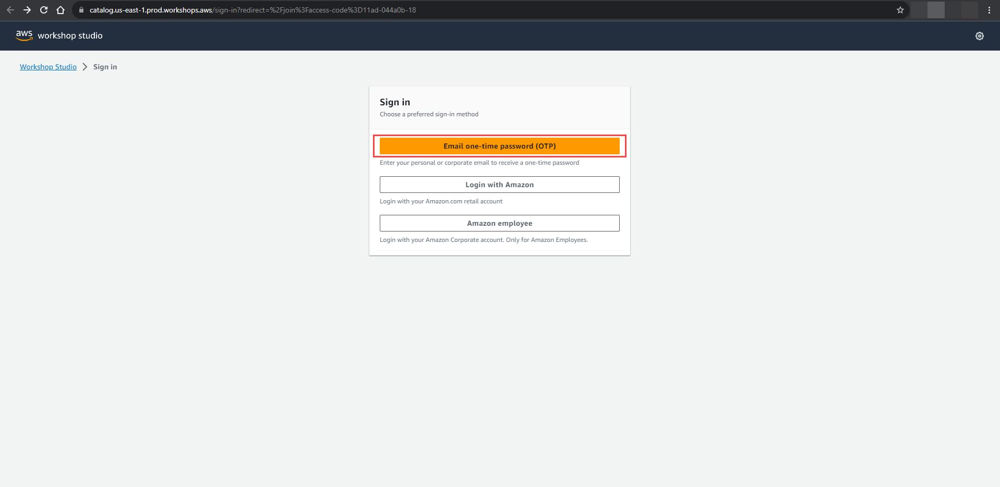
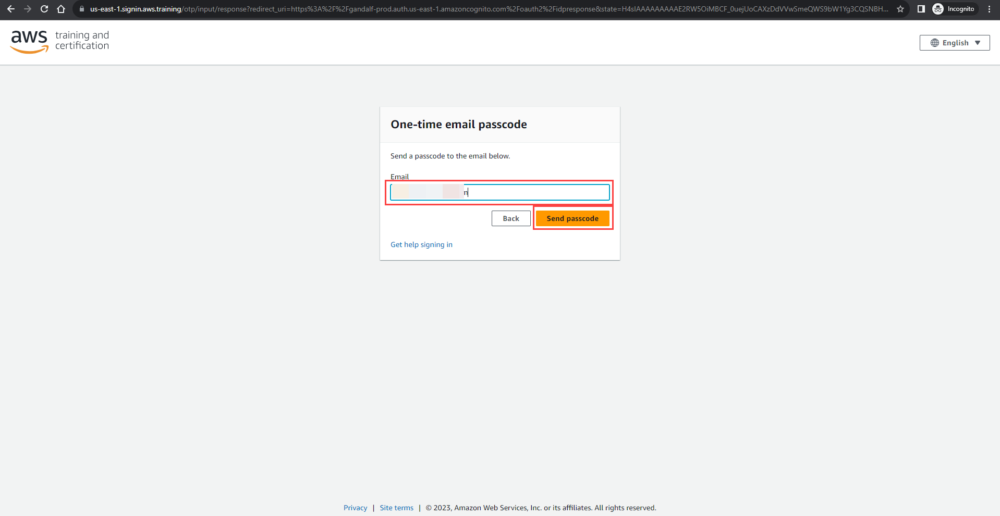
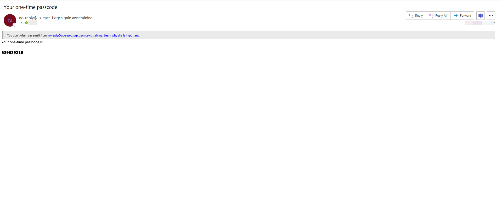
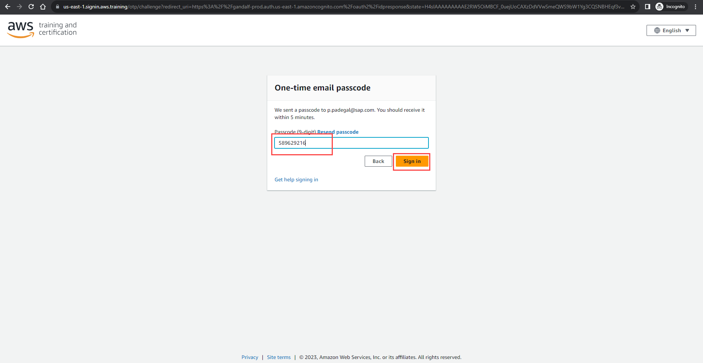
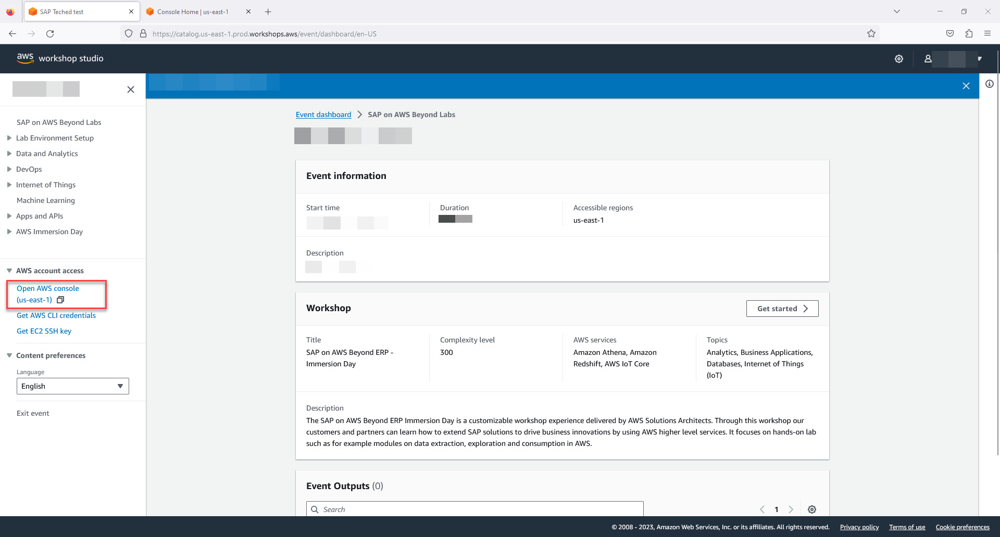
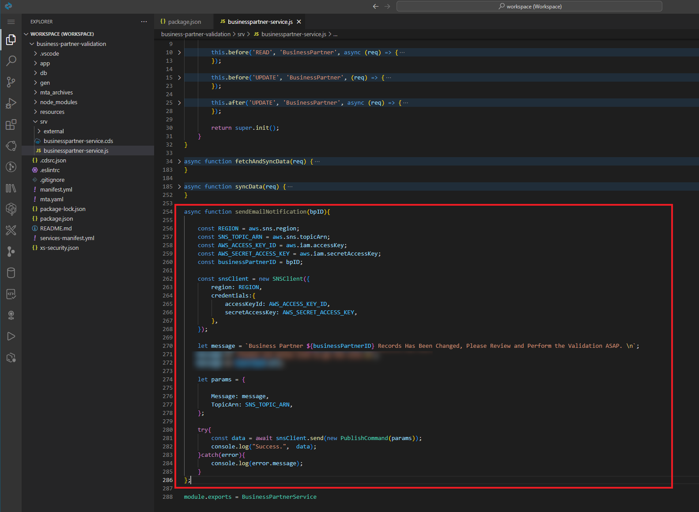

# Exercise 1.3 Integrate the CAP Application with Amazon SNS

In the exercise of this unit, we will introduce how to integrate the Amazon Simple Notification Service (SNS) with our Business Partner Validation application, By using the AWS SDK for SNS. After finishing this exercise, you will achieve the following objectives
 - Understand how to configure the Amazon Simple Notification Service Topic on the AWS Management Console.
 - Understand how to protect your Amazon SNS Topic with the Amazon IAM Access Policy.
 - Understand how to consume the Amazon SNS Topic programmatically within the SAP CAP project by using the AWS SDK for SNS.

Pre-requisities:
1. Please click on [AWS workshop studio](https://catalog.us-east-1.prod.workshops.aws/join?access-code=11ad-044a0b-18) to access Amazon Web Services account that you will be using for this exercise.

2. Click on **Email one-time password (OTP)**
    
   

3. In the **Email** field, Enter your personal email id and click on **Send passcode**

    

4. You will receive email with the passcode.

    

5. Enter the passcode that you received in the above step and click on **Sign in**

    

6. Once the signin is successful, it redirects to event page. in the event page, click on **Open AWS console** to open the AWS console.

    

**You can find the complete sample code of this exercise [here](../sample-code)**.

## Step 1 - Setup Amazon Simple Notification Service (SNS)

> - Please note down below values after you finish this section
>   - Amazon SNS Topic ARN
>   - Amazon SNS Topic Region
>   - Amazon IAM User Access Key
>   - Amazon IAM User Secret Access Key

Amazon Simple Notification Service is a regional service, please create the Amazon SNS Topic in the AWS region which is equal to the region of your BTP subaccount, so that we can minimize the latency.

Please Note: There are changes in the user interface in SAP BTP and AWS services from the time the course was recorded. All these changes will be updated constantly in the GitHub repository.

1. In the **AWS console**, search for **Simple Notification Service** and click on **Simple Notification Service**

    

1. 👉 Click **Topics** on the left panel, then click the **Create Topic** button.

    

2. 👉 Select **Standard** Topic type, give the proper topic name and display name. **Leave everything as it is**, and click the **Create Topic** button. 

    

3. 👉 Once the topic creation is complete successfully, **note down** the **Topic ARN** (Amazon Resource Name) and **Topic Region** value. We will use it later in the exercise.

    

> - You could find the Topic Region value inside of the Topic ARN.

4. 👉 Click on the **Create Subscription** button. In the **Create subscription screen**, choose **Protocol** as **Email**, and then **give your email address** to the **Endpoint**, then click the **Create subscription** button to complete the topic subscription. 

    

5. 👉 You will receive an email asking to confirm the topic subscription. Follow the instructions in the email to confirm the subscription.

    

## Step 2 - Setup Amazon IAM Access Policy

1. 👉 Open the Amazon **Identity and Access Management (IAM)** management console. Select **Policies** on the left menu and then click the **Create Policy** blue button to create a new IAM policy.

    

2. 👉 In the **Specify permissions** screen, select **Service** as **SNS**, choose **Actions allowed** as **Publish**, and enter the **SNS Topic ARN** value with the one we just created. Click **Next**.

    

3. 👉 In the **Review and Create** screen, give a proper, read-friendly name for this new IAM policy. Review everything, if it all looks good, click the **Create policy** blue button to create the new IAM policy. **Note Down the name of this policy**, as we will need it in the next step.

    

## Step 3 - Setup Amazon IAM User with Access Key and Secret Access Key

1. 👉 Open the Amazon **Identity and Access Management (IAM)** management console. Select **Users** on the left menu and then click the **Add Users** blue button to create a new IAM user.

    

2. 👉 Give the proper, read-friendly name to your new IAM user, **do not grant AWS management console access**, then click Next.

    

3. 👉 Choose **Attach policies directly**, then **attach the IAM policy we just created in the last step** to it. Click **Next**.

    

4. 👉 Review everything, if it all looks good, click the **Create user** to create the new IAM user.

    

5. 👉 Find out the Amazon IAM user we just created. Switch to the **Security credentials** tab, and then click the **Create access key** button in the Access keys section.

    

6. 👉Choose the **Application running outside AWS**. Click **Next**.

    

7. 👉 Click the **Create access key** button to finish the access key creation.

8. 👉 **Note down** the value of **Access Key**, **Secret access key**, and **IAM User ARN**. This is the only time that you could view the value of these keys.

    

## Step 4 - Update Access Policy of Amazon SNS Topic

1. 👉 Go back to the **Amazon Simple Notification Service Management Console** and select the SNS Topic we just created in the previous step. Click the Edit button.

    

2. 👉 Expand the **Access policy** tab. Overwrite the access policy as shown below. Then click the **Save Changes** button.

    ```node.js
    {
      "Version": "2008-10-17",
      "Id": "__default_policy_ID",
      "Statement": [
        {
          "Sid": "__default_statement_ID",
          "Effect": "Allow",
          "Principal": {
            "AWS": "IAM-USER-ARN-WE-JUST-CREATED"
          },
          "Action": "SNS:Publish",
          "Resource": "AMAZON-SNS-TOPIC-ARN"
        }
      ]
    }
    ```

    

## Step 5 - Consuming the Amazon Simple Notification Service Topic in the SAP CAP Project.


  You have completed Step 1 - Setup Amazon Simple Notification Service (SNS) and have the below values handy.
- **Amazon SNS Topic ARN**
- **Amazon SNS Topic Region**
- **Amazon IAM User Access Key**
- **Amazon IAM User Secret Access Key**
- **Frontend Fiori application's URL** 

1. 👉 Let's Install AWS SDK for Node.js in the SAP CAP Project. Open the Business Partner Validation project in the SAP Business Application Studio. Open a new terminal and then issue the command **npm install @aws-sdk/client-sns --save**.

    

2. 👉 After the installation is completed, open the **package.json** file under your project root directory. You will see that the AWS SDK - SNS Client has been added under the **dependencies** section.

    

## Step 6 - Modify the SAP CAP Project Code

1. 👉 Let's **modify the package.json file** under the **project's root directory**, so that we can add the AWS SNS credentials, and also the frontend Fiori application's endpoint as the environment variables. Ensure you have the below details in package.json under the **cds.requires** section.

    ```node.js
    "cds":{
      ...
      "requires":{
        ...
        "aws": {
          "sns": {
            "topicArn": "REPLACE-WITH-YOUR-AWS-SNS-TOPIC-ARN",
            "region": "REPLACE-WITH-YOUR-AWS-SNS-TOPIC-REGION"
          },
          "iam": {
            "accessKey": "REPLACE-WITH-YOUR-AWS-IAM-USER-ACCESS-KEY",
            "secretAccessKey": "REPLACE-WITH-YOUR-AWS-IAM-USER-SECRET-ACCESS-KEY"
          }
        },
        "launchpad": {
          "url": "REPLACE-WITH-YOUR-FRONTEND-FIORI-APPLICATION-URL"
        },
      }
    }
    ```

    


2. 👉 Open the **srv/businesspartner-service.js** file. Let's first import the AWS SNS Client, and CAP CDS environment variables we just defined into this file. 

    ```node.js
    const { SNSClient, PublishCommand } = require('@aws-sdk/client-sns');
    const { aws, launchpad } = cds.env.requires;
    ```

    

3. 👉 Let's create a new async function, which will be responsible for sending out the email notification programmatically to the Amazon SNS Topic.

    ```node.js
    async function sendEmailNotification(bpID){

        const REGION = aws.sns.region;
        const SNS_TOPIC_ARN = aws.sns.topicArn;
        const AWS_ACCESS_KEY_ID = aws.iam.accessKey;
        const AWS_SECRET_ACCESS_KEY = aws.iam.secretAccessKey;
        const businessPartnerID = bpID;

        const snsClient = new SNSClient({
            region: REGION,
            credentials:{
                accessKeyId: AWS_ACCESS_KEY_ID,
                secretAccessKey: AWS_SECRET_ACCESS_KEY,
            },
        });

        let message = `Business Partner ${businessPartnerID} Records Has Been Changed, Please Review and Perform the Validation ASAP. \n`;
        message += `Please use below link to go the site.\n`;
        message += launchpad.url;
        
        let params = {

            Message: message,
            TopicArn: SNS_TOPIC_ARN,
        };

        try{
            const data = await snsClient.send(new PublishCommand(params));
            console.log("Success.",  data);
        }catch(error){
            console.log(error.message);
        }
    };
    ```

    

4. 👉 Finally, let's **enhance** the **syncData function** to **leverage the sendEmailNotification function** we just created. Add the code shown below at the **very end** of the syncData function.

    ```node.js

    async function syncData(req){

      ....,

      // Send out SNS Notification while Business Partner's Verfication Status = P
      if(verificationStatus_code === 'P'){

        await sendEmailNotification(bpID);
      }
    }
    ```

    

## Step 7 -  Deploy the Code Changes to the SAP BTP Trial Subaccount

> - Make sure your SAP HANA DB is in the running status. The SAP HANA DB in the SAP BTP trial account will stop every single night automatically.

1. 👉 **Right-click** on the **mat.yaml** file under your project root directory, and then choose **Build MTA Project** from the menu. 

    

2. 👉 Once the MTA Build process is complete, expand the **mta_archives** folder, **right click** on the **business-partner-validation_1.0.0.mtar** file. Choose **Deploy MTA Archive** from the menu to trigger the SAP BTP trial deployment process.

    

3. 👉 Wait until the deployment process is completed. Grab a cup of coffee and take a rest as the deployment process will take some time.

## Step 8 -  Testing the Business Partner Validation Application from End-to-End

1. Navigate to [HTML5 Applications](https://emea.cockpit.btp.cloud.sap/cockpit/?idp=tdct3ched1.accounts.ondemand.com#/globalaccount/e2a835b0-3011-4c79-818a-d7767c4627cd/subaccount/70d96fca-b36b-4215-81c8-c263e090bea5/html5applications) page in SAP BTP cockpit and open your deployed fiori app `(search with: 0XX)`


<!-- 1.  👉 Go back to your SAP BTP Trial subaccount. Go to **Instance and Subscriptions**. Click the **Go to application** button of the **SAP Build Work Zone, standard edition** service subscription.

    

2. 👉 Click **Go to site** button to navigate to the OpenSAP-AWS-Course-Week3 site.

    

3. 👉 Click Manage Business Partner App.

     -->

4. Now click **Go** to browse all unblocked Business Partner Data fetching from S4-Mock-Server. Now you will see all the Business Partners are in the VERIFIED status.

    

    

5. 👉 Click on the first Business Partner 1004155 record in the table, this will navigate you to the details page. Let's now try to update the address data of this business partner by clicking the edit button.

    

6. 👉 **Update the business partner data as shown in the image below**. Then click **Save** to persist the updated data to the SAP HANA DB. **Make sure to update the Verification Status value from V to P by selecting from the dropdown**. Now we should expect to receive an email notification sent from the Amazon SNS topic we created previously.

    

7. 👉 Open your email box, then you should see an email with the title **AWS Notifications******. Open this email and you should see the message to indicate us the Business Partner 1004155 record has been changed. The Fiori application of the Business Partner Validation app is also included in the email. We could click on this URL and it will redirect us back to the Fiori application.

    

## Congratulation!

Congratulations, you have successfully integrated the Amazon Simple Notification Service with the SAP CAP project and deployed the entire project to the SAP BTP Trial subaccount successfully. Well done !!
