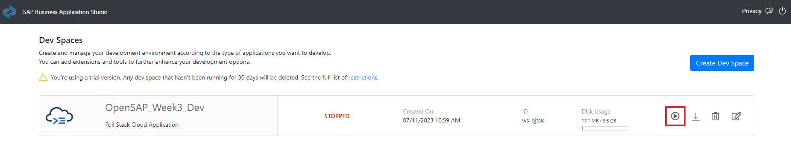
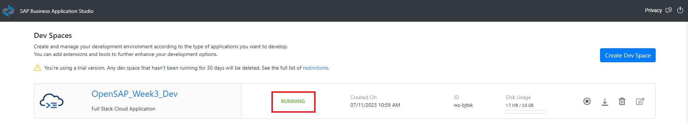
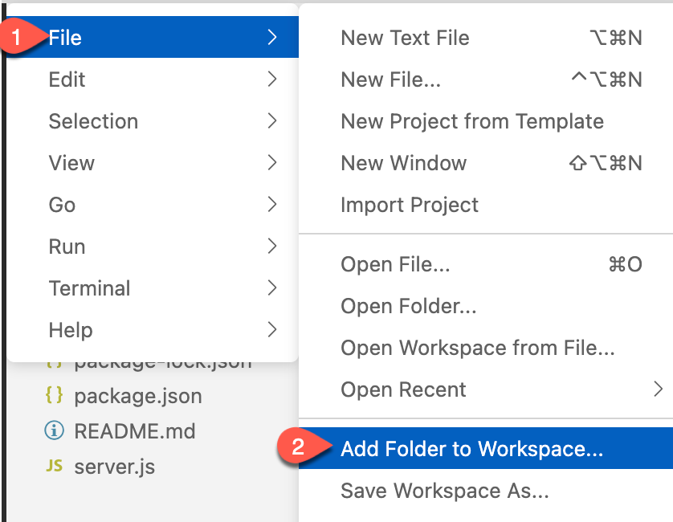

# Extend a Business Process Using a CAP Application on SAP BTP

## Section 1. Create Business Partner Validation Application - Backends Service with SAP CAP in Node.js

### Step 1. Create a SAP CAP Node.js Project in the SAP Business Application Studio

<details>

In this section we will focus on creating a Node.js CAP project in the Business Application Studio

---
**1.1** Login into your SAP BTP trial subaccount. Click the **Instance and Subscriptions** on the left menu, and then click **Go to Application** button of the SAP Business Application Studio service subscription.


**1.2** Now you will see the Dev Space we created previsouly is in **STOPPED** status, lets activate it by clicking the Run botton 



**1.3** When it’s ready, open your dev space by clicking on the name. 



<details>

### Build and Deploy

1. In the menu in SAP Business Application Studio, select **Terminal** &rarr; **New Terminal** and navigate to the projects folder using:

   ```bash
      cd projects
   ```

2. Clone the mock server GitHub repository:

   ```bash
      git clone https://github.com/alphageek7443/business-partner-validation
   ```

3. Choose **File** in the menu on the top and then select **Add Folder to Workspace** from the dropdown menu.

  

4. Open the project by choosing **projects** &rarr; **business-partner-validation** and choose **Open**.

### Step 3. Consume S4-Mock-Server API by using Remote Service functionality provided by SAP CAP

In our Business Partner Service, we need to fetch the latest Business Partner data from the S4-Mock-Server by consuming the OP_API_BUSINESS_PARTNER_SRV API exposed by S4-Mocker-Server application.

In this section, we will introduce how to consume the external APIs by using the [Remote Service](https://cap.cloud.sap/docs/guides/using-services#introduction) functionality in the SAP CAP application.

> **Good to read before start**
>
> - [Consuming Services](https://cap.cloud.sap/docs/guides/using-services)
>
> The CAP runtimes for node.js not only supports consuming the service via [Axios](https://axios-http.com/docs/intro), Fetch API, but also provides you an easy functionlity, called [Remote Service](https://cap.cloud.sap/docs/guides/using-services#introduction) to consume the external CAP service or OData Service.

---
**3.1** Enter the **S4-Mock-Server service endpoint** in your browser, and click on the **$metadata (V2)** after the /op-**api-business-partner-srv / $metadata → Open API →**. It will bring up the service definition in the XML format.


**3.2** **Right Click on the browser**, and choose **Save as**, rename the file as s4-mock-server and click Save button to download the S/4-Mock-Server Business Partner API service difinition file into local machine.


**3.3** **Drag and drop** the **s4-mock-server.xml** file we just downloaded from our local machine in to the Business Application Studio IDE, and place it under the root directory of the CAP project. 


**3.4** Issue the command **cds import s4-mock-server.xml** in your terminal, this is the CDS command used by the SAP CAP framework to import the external service definition and make it consumable in the CAP project. You should see **using { s4_mock_server as external } from './external/s4-mock-server'** showing up in your terminal. The **S4-Mock-Server Service Client Objects** has been added under the **srv/external** directory automatically.

> For more information regards consuming remote service in SAP CAP framework, please go to [here](https://cap.cloud.sap/docs/guides/using-services#external-service-api)


5. In the project folder, right-click on the `mta.yaml` file and select **Build MTA Project**.

   

6. When the build was successful, you will see a new folder **mta_archives** in your project with the **Mockserver_1.0.0.mtar** file. Right-click on that file and select **Deploy MTA Archive**.

   


