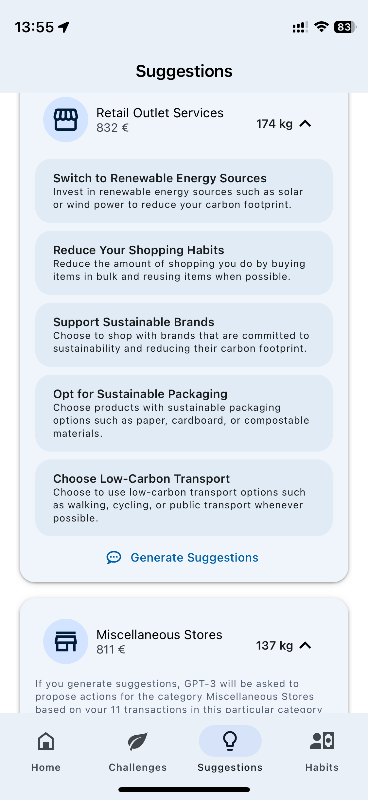

# Introduction

In this exercise, you will develop a fully functional mobile business application that is integrated with a Large Language Model running on Azure Open AI services. You will deploy an SAP Cloud Application Programming backend that interacts with the LLM through SAP LLM Access Laye,  and a React Native mobile app implementing a Smart CO2 Converter App. 

Broadly, this consists of:

**SAP BTP services and components such as the SAP Cloud Application Programming (CAP) model, SAP AI Core, SAP HANA Cloud, and SAP destination service**

The SAP BTP, Cloud Foundry Runtime allows you to create polyglot cloud applications in Cloud Foundry. It contains the Cloud Foundry Runtime service, which is based on the open-source application platform managed by the Cloud Foundry Foundation.
You can deploy your Cloud Foundry applications in different regions, each of which represents the location of a data center.
You can leverage a multitude of buildpacks, including community innovations and self-developed buildpacks. This runtime platform enables you to develop and deploy web applications, supporting multiple runtimes, programming languages, libraries, and services. In this exercise, the backend as well as the frontend will be deployed and run on SAP BTP, Cloud Foundry Runtime.

SAP HANA Cloud provides a single place to access, store, and process all enterprise data in real-time. It is a cloud-native platform that reduces the complexity of multi-cloud or hybrid system landscapes. SAP HANA Cloud provides all of the advanced SAP HANA technologies for multi-model data processing in-memory or on disk. You can benefit from cloud qualities such as automatic software updates, elasticity, and low total cost of ownership by using SAP HANA Cloud either as a stand-alone solution or as an extension to your existing on-premise environment.

SAP AI Core is part of the services portfolio that SAP BTP provides. It is used to train a machine learning model and to deploy the model in the form of a service running in the cloud on SAP BTP. Clients can then send data to the service endpoint and will receive the model's prediction based on that data as a response. Both model training and serving happen in a scalable and for the most part hyperscaler-agnostic way.

SAP AI Launchpad is an application in SAP BTP. With it, one can overview one's own AI use case having the convenience of a user interface in the browser. It showcases artifacts that are relevant to your use case like the dataset used for training and the trained model. Further one can observe the training and serving process and the underlying configurations that are used for them.

**Chat-GPT, Large Language Models and Azure Open AI Services**

ChatGPT is a large language model developed by OpenAI, based on the GPT (3.5 or GPT-4) architecture. It is a machine-learning algorithm that is capable of understanding and generating human-like text in response to user input. ChatGPT has been trained on a massive dataset of text from the internet, allowing it to generate text in a wide range of styles and formats.

Large Language Models (LLMs) like ChatGPT are revolutionizing the field of natural language processing (NLP) by enabling computers to process, generate and understand human language like never before. They are capable of performing a wide range of language-related tasks, such as translation, summarization, question-answering, and even creative writing. With their advanced abilities to understand and generate human language, LLMs like ChatGPT are poised to have a profound impact on a wide range of industries, from customer service and education to healthcare and finance.

Azure OpenAI Service provides REST API access to OpenAI's powerful language models. These models can be easily adapted to your specific task including but not limited to content generation, summarization, semantic search, and natural language to code translation. Users can access the service through REST APIs, Python SDK, or the web-based interface in the Azure OpenAI Studio.

**React Native**

React Native is a framework for building mobile applications using JavaScript and React. It allows developers to create native mobile apps for both iOS and Android platforms, using a single codebase, which results in faster development times and lower costs. In addition to supporting JavaScript, React Native also provides support for TypeScript, a typed superset of JavaScript that enables developers to write more scalable and maintainable code by catching errors early in the development process.

In addition to React Native, there are various tools and services available that can enhance and simplify the process of building mobile applications using this framework. One such tool is Expo, a comprehensive set of tools and services built around React Native. Expo aims to streamline the development process by providing an integrated development environment and access to pre-built components and libraries. Expo supports both JavaScript and TypeScript and includes features like live reloading, push notifications, and over-the-air updates, which can make the app development process faster and more efficient. By using Expo, developers can have a more seamless experience building React Native apps and gain access to many useful features and libraries.

## Reference Architecture of an SAP BTP CAP Application using GPT Models of OpenAI

You want to make use of one of the Large Language Models (LLMs) like the GPT family of LLMs offered by Microsoft Azure OpenAI in combination with an application running on SAP Business Technology Platform (BTP), here is our recommendation how to achieve this and also benefit from the BTP capabilities.
Refer to this documentation for more details - https://github.com/SAP/sap-btp-reference-architectures/blob/main/hyperscalers/openai/README.md

## Technical Architecture 

## Exercise Outcome

After completing these steps you will have a mobile app built using the reusable architecture principles of SAP Cloud Application Programming (CAP) model and React Native on SAP BTP. An application extension using GPT via the Azure Open AI service that combines business context with the capabilities of large language models on SAP BTP.

  
  
  
  

## Get Started

Exercise 1 - [Prepatory Steps](../MicrosoftAzure/ex3.1/Preparation.md) \
Exercise 2 - [API CAP Deployment](../MicrosoftAzure/ex3.2/API_CAP_Deployment.md) \
Exercise 3 - [Deploy Mobile App using Expo Go](../MicrosoftAzure/ex3.3/Run_Mobile_App_Local.md) \
Exercise 4 - [Publish App on Expo Go (Optional)](../MicrosoftAzure/ex3.4/Publish_Mobile_App(OPTIONAL).md) \
Exercise 5 - [Enable SAP LLM Access](../MicrosoftAzure/ex3.5/Add_LLM_Access.md)
