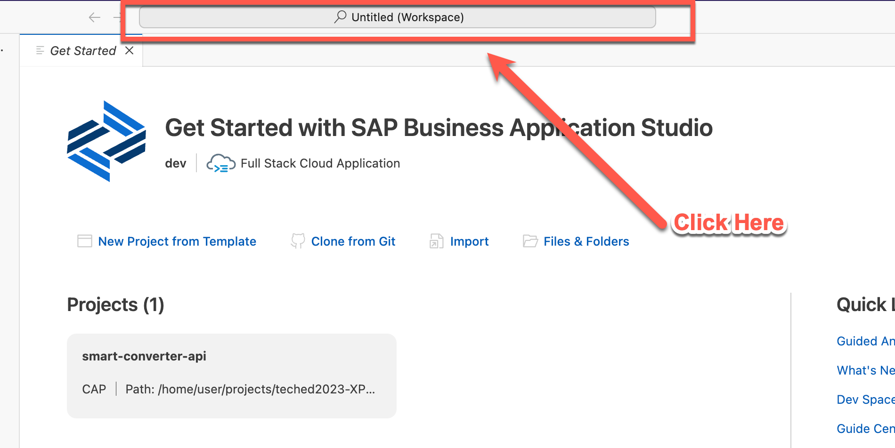
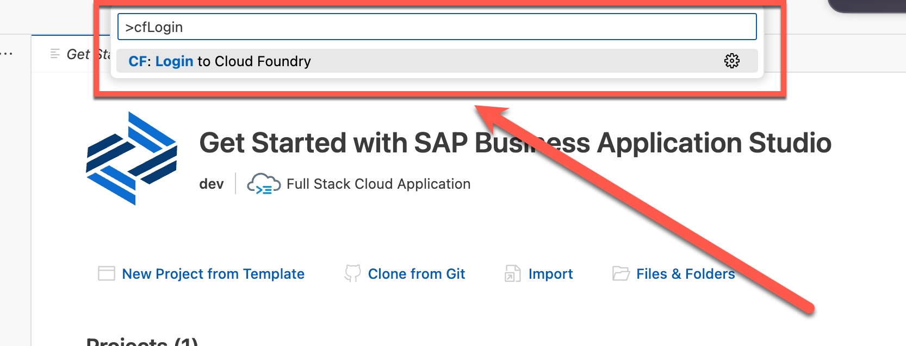
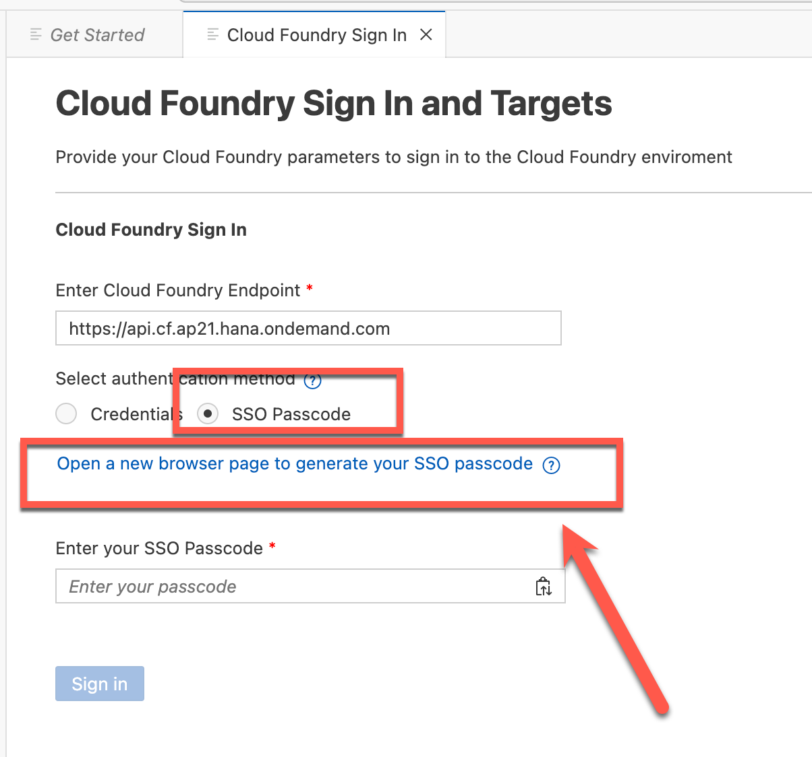
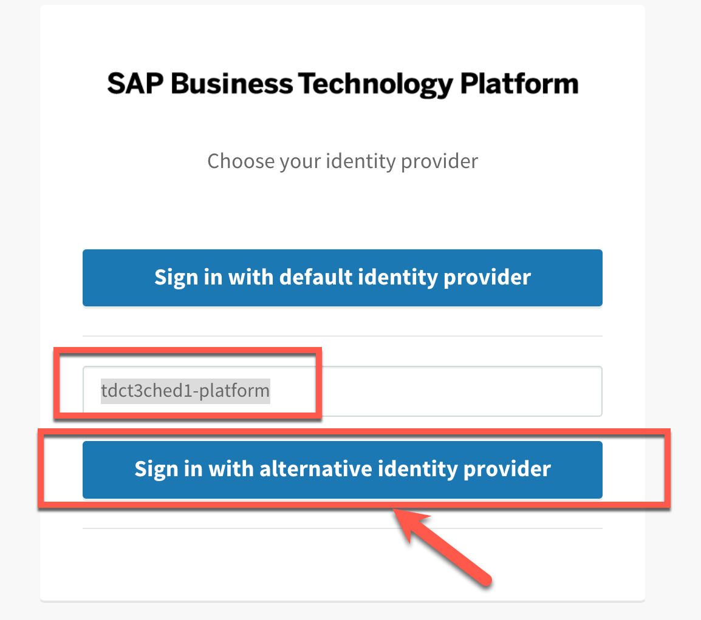
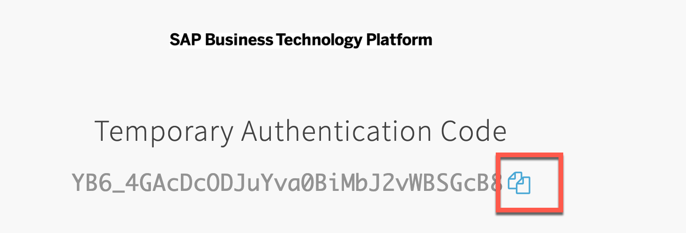
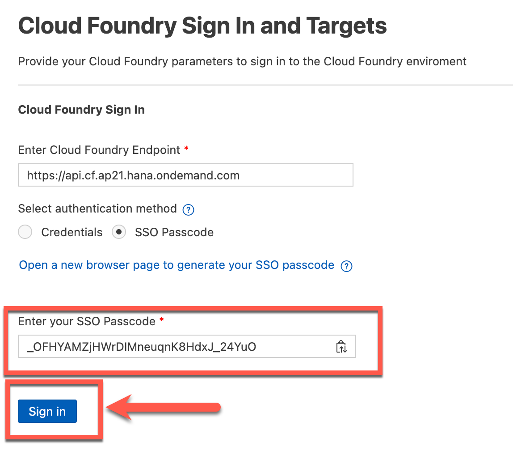
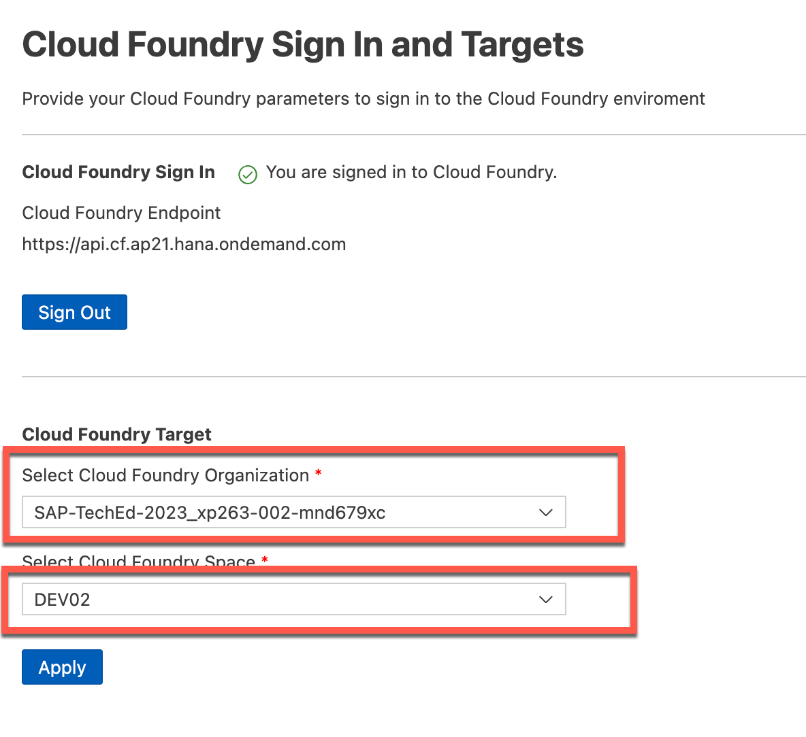
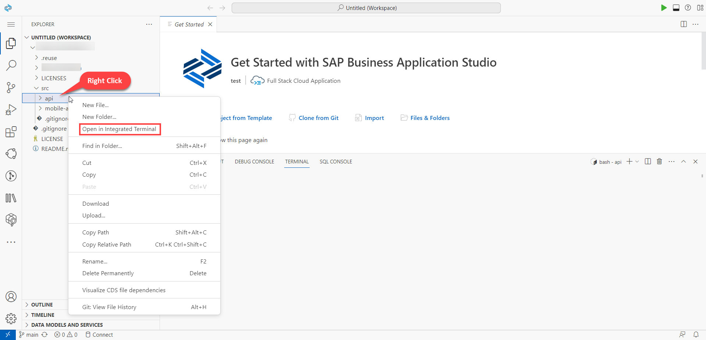
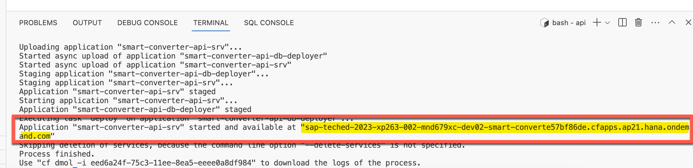

# EXERCISE 2. Deploy CAP API to Cloud Foundry
<!--
1. Set a custom _API_KEY_ (preferably a string generated on your machine) in your `src/api/mta.yaml` which will be used as simple authorization for the React Native app (and as well during testing via an API Platform like Postman setting the _API_KEY_ as header `api-key`. It is akin to any password. Users can also choose to keep it as the default value in the code.

   ```yaml
   ...
   modules:
   - name:  smart-converter-api-srv-${space}
      type: nodejs
      path: gen/srv
      parameters:
         buildpack: nodejs_buildpack
      build-parameters:
         builder: npm-ci
      provides:
         - name: srv-api # required by consumers of CAP services (e.g. approuter)
         properties:
            srv-url: ${default-url}
      requires:
         - name: smart-converter-api-db
         - name: smart-converter-api-auth
         - name: smart-converter-aicore-dest
      properties:
         API_KEY: <YOUR_API_KEY>
      ...
   ```
-->
1. Now to login to cloud foundry, click the Business Application Studio search bar. Enter ">cfLogin" (including ">") and select the "CF: Login to Cloud Foundry".

   

   

2. Choose the "SSO Passcode" option and click the "Open a new broswer page..." link.

   

3. Enter "tdct3ched1-platform" and choose "Sign in with alternative identity provider".

   

4. Click the copy button to save it to the clipboard and paste it in "SSO passcode". Click "Sign in".

   

   

5. Select the cloud foundry organization and space and click "Apply".

   

2. Open new integrated terminal as shown below for the folder `src/api/` (Right click on the folder).

  

4. In the terminal, install all dependencies for the API deployment through below command:
   ```console
   $ npm i # creates node_moudles directory
   ```
7. Deploy the API through:
   ```console
   $ npm run deploy # command reference can be checked in src/api/package.json
   ```

8. Wait till the deployment is finished. If all entitlements of your SAP BTP Subaccount are set correctly, you should get the following output at the end of the deployment:

   

9. Copy this URL, which will be used in the React Native application to connect to the CAP backend


Continue to - [Exercise 3: Run App Locally on Web Browser](../ex3.3/README.md) where you will enable the mobile app to run locally on mobile devices
