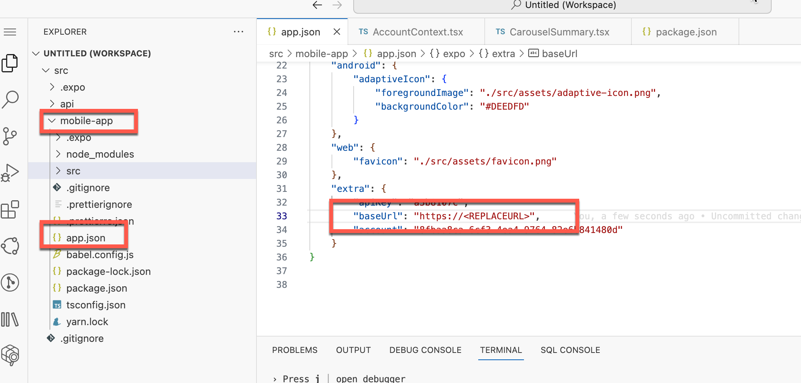
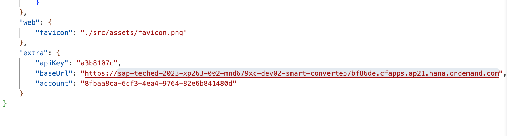
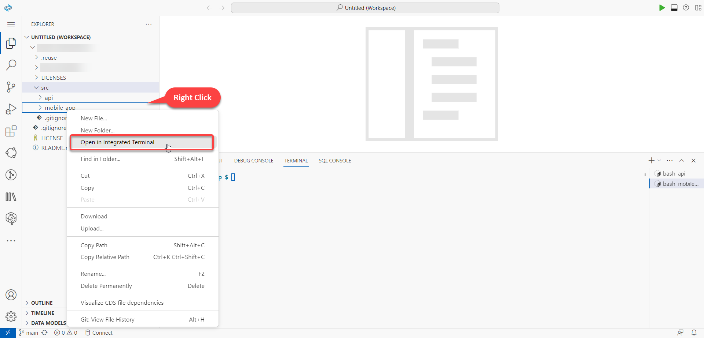
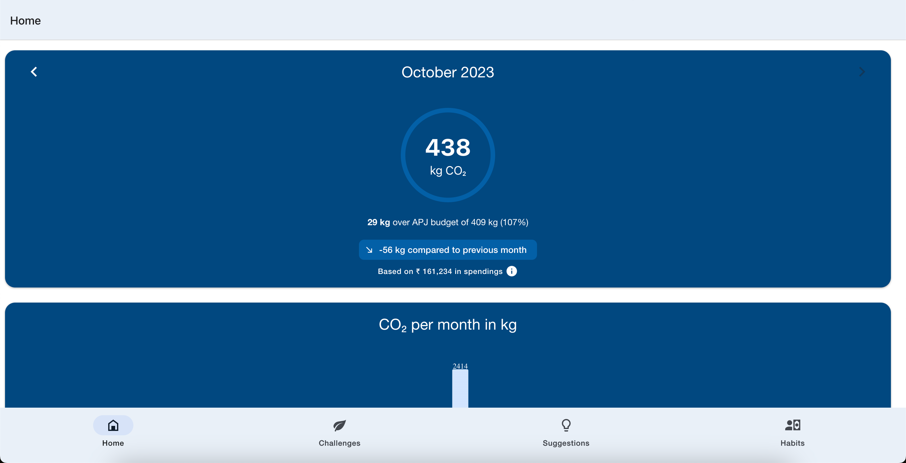

# EXERCISE 3. Run the App on Web Browser

## Start the React Native app

1. Open the `app.json` file and paste the URL that you copied from the last exercise here `<REPLACEURL>`, as shown below.

   

   

2. Now, open the integrated terminal on the folder `src/mobile-app/`  (Right Click).

   

   Users would also require Expo Go CLI on their local systems. It is an open-source platform for making universal native apps for Android, iOS, and the web with JavaScript and React. It can be installed by running the following command in the terminal:

  ```console
    $ npm install -g expo-cli
  ```

2. To install dependencies like in previous step, user has to execute below command:

   ```console
   $ npm i
   ```

3. In order to start the React Native app, execute the following command:

   ```console
   $ npm run web
   ```

   If everything is performed correctly, you should see an output like this:

   ```console
   $ expo start
   Starting project at ...
   Starting Metro Bundler
   ▄▄▄▄▄▄▄▄▄▄▄▄▄▄▄▄▄▄▄▄▄▄▄▄▄▄▄
   █ ▄▄▄▄▄ █▄▄▄ ▀▀▀█▄█ ▄▄▄▄▄ █
   █ █   █ ██▄▀ █ ▀▄██ █   █ █
   █ █▄▄▄█ ██▀▄ ▄ ██▀█ █▄▄▄█ █
   █▄▄▄▄▄▄▄█ ▀▄█ ▀ ▀ █▄▄▄▄▄▄▄█
   █▄ █▄ █▄█▀▄▀█▄██▀ █▄█▀█▀▀▄█
   ██▄▄  █▄▄█▄██▄█ ▄▀▀███▄▀▀ █
   █  ▄ ▀█▄█▄▄ █▀█▄ █ ▄▀▀█▀ ██
   █ ▄█ █▄▄ █ ▀█▀▄█ ▄▀ ██▄▀  █
   █▄█▄█▄▄▄▄▀█▀ ▄▄ █ ▄▄▄  ▄▀▄█
   █ ▄▄▄▄▄ ██▄▄▀▄  █ █▄█ ███ █
   █ █   █ █ ▀ ▄ ██▄ ▄  ▄ █▀▀█
   █ █▄▄▄█ █▀▄▀  █▄ ▄█▀▀▄█   █
   █▄▄▄▄▄▄▄█▄█▄▄██▄▄▄▄█▄▄███▄█

   › Metro waiting on exp://192.168.0.48:19000
   › Scan the QR code above with Expo Go (Android) or the Camera app (iOS)

   › Press a │ open Android
   › Press i │ open iOS simulator
   › Press w │ open web

   › Press j │ open debugger
   › Press r │ reload app
   › Press m │ toggle menu

   › Press ? │ show all commands
   ```

4. This will open a new tab automatially and take you to the application.

   


Perfect! You should now be able to use the app. You can skim through the various windows and accessories.

But you will notice that on calling GPT from anywhere within the app, no response will be generated. For this, users will have to enter the right credentials for the Generative AI Hub, that accsses GPT-3.5 from Azure OpenAI. This will be done in the next step [Exercise 4: Fetch SAP Generative AI Hub Credentials](../ex3.4/README.md).
