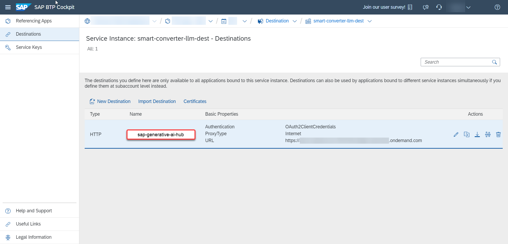
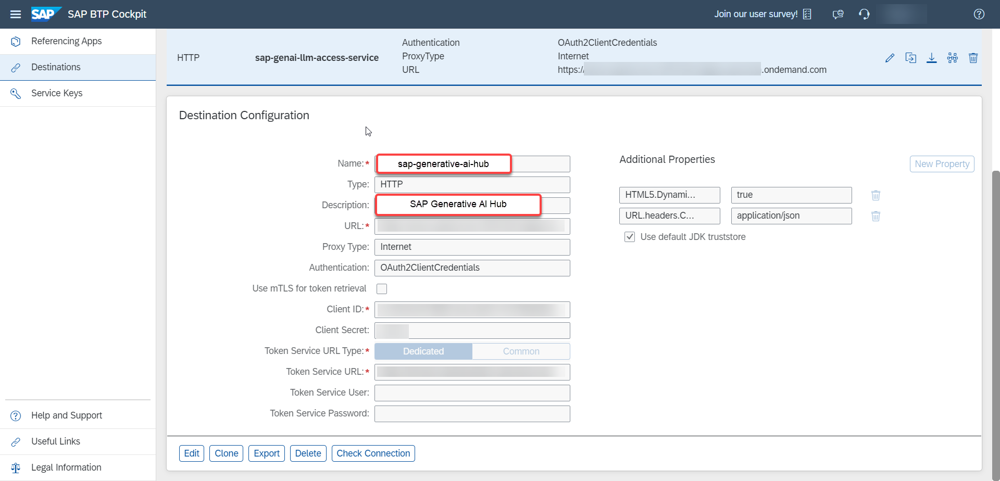

# EXERCISE 5. Enable LLM Access

Users would now update credentials on their BTP sub-account.

1. Open your subaccount on BTP Cockpit and enter the **Spaces** tab in the **Cloud Foundry** drop-down.


2. This will open up the spaces page where the user will have to select their developer space.


3. Inside the space, user has to click on the **Instances** tab under **Services** drop-down.


4. In the next window find the **smart-converter-llm-dest** destination. This destination links to the LLM Access layer. 


5. On opening the **smart-converter-llm-dest** destination, the user will have to go to the **Destinations** tab.


6. On the next page, user will have to click the **sap-generative-ai-hub** field. This will open the _Destination Configuration_ editor. 


7. The **Edit** button has to be clicked which will allow the user to change the configuration of the fields. Following credentials will be provided which need updating on the editor as discussed in the last step.
   
   -> URL
   
   -> Token Service URL
   
   -> Client ID
   
   -> Client Secret
   
    

Make sure that **Use JDK truststore** box is checked. 

8. Once entered, user has to click on **Save** to preserve the configuration. Now the application is setup to run the LLM service.

    


Great! The SAP generative AI hub destination is now set up. Users will now be able to utilize the LLM capabilities and experience personalized summaries and suggestions to mitigate CO2 emissions.

    

   

You can also try various other options, that will trigger the Gen AI service and gives the results. `(Navigate to Suggestions Or Habits tab**)`


>Note: Just for reference, in the CAP application, the following part from `src/api/srv/mta.yaml` is where the credentials are housed. On updating them through BTP cockpit, users will be able to interact with the LLM (in this case, gpt-3.5-turbo) in the mobile app.

```yaml
.
.
.
  # -------------------- DESTINATION SERVICE -------------------
  - name: smart-converter-llm-dest
  # ------------------------------------------------------------
    type: org.cloudfoundry.managed-service
    parameters:
      service: destination
      service-plan: lite
      config:
        init_data:
          instance:
            existing_destinations_policy: update
            destinations:
              - Name: sap-generative-ai-hub
                Description: SAP Generative AI Hub
                URL: "<GEN AI Hub Deployment URL>" # to be entered in BTP Cockpit
                URL.headers.Content-Type: application/json
                URL.headers.AI-Resource-Group: tfe-india
                Type: HTTP
                ProxyType: Internet
                Authentication: OAuth2ClientCredentials
                tokenServiceURL: "<Token Service URL>" # to be entered in BTP Cockpit
                clientId: "<Client ID>" # to be entered in BTP Cockpit
                clientSecret: "<Client Secret>" # to be entered in BTP Cockpit
                HTML5.DynamicDestination: true
```

## Congratulations! You have successfully completed the hands-on exercise.

> If users wish to publish the mobile application under their own Expo Go account, they can follow steps given in SAP Discovery Center Mission [Reduce your CO2 footprint using a smart Generative AI application on SAP BTP](https://discovery-center.cloud.sap/protected/index.html#/missiondetail/4264/4522/)

