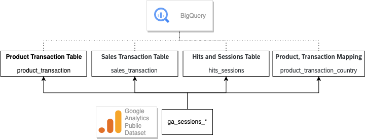
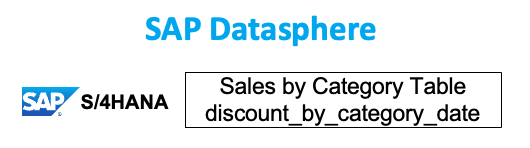
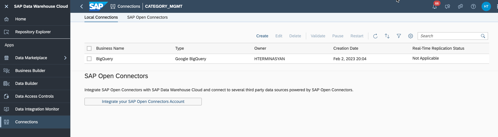
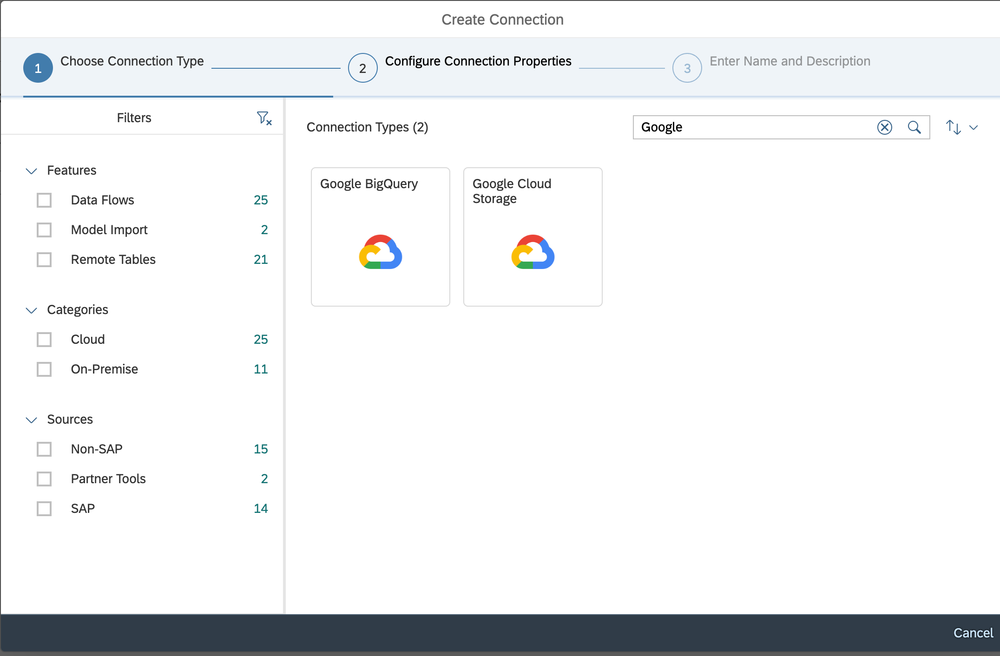
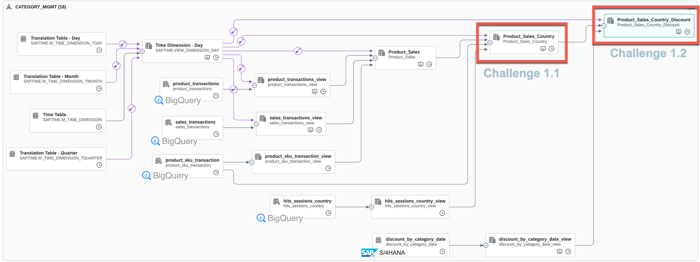
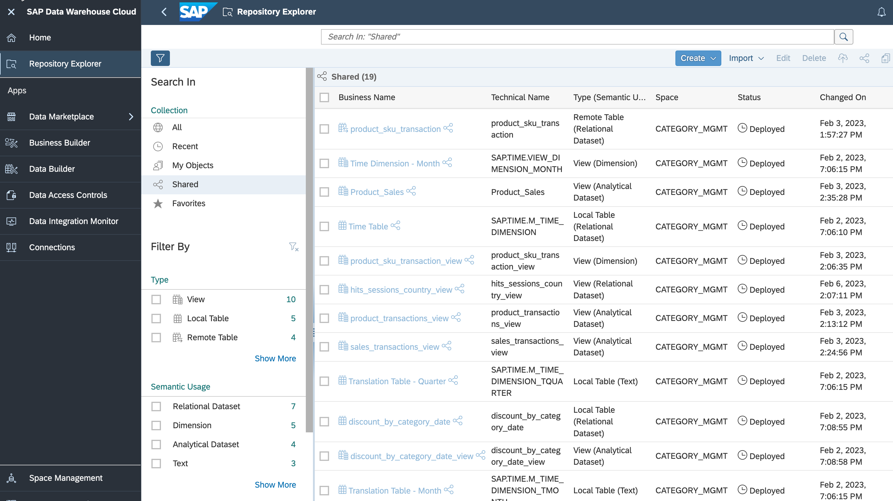

# Discover - Understand SAP Datasphere and Google BigQuery setup and given data models

> **IMPORTANT**: This section is for informational purposes only and does not require any actions to be taken by the participants. Its aim is to provide a better understanding of the preconfigurations. The goal is to provide a clear understanding of the concepts and techniques involved, without the need for any hands-on implementation.

## Role of SAP Business Technology Platform (SAP BTP)
 - With SAP Datasphere, customers can federate queries across source systems (SAP and Google) without the need for data replication. 
 - SAP Analytics Cloud (SAC) customers can execute live on the fly analysis across cross-cloud data sources in real-time (and live analytics to SAP HANA systems).
 - Unified SAP data model and semantics propagated from SAP S/4HANA and SAP CX systems to SAP Datasphere and SAC

## Role of Google Cloud 
 - Query all data types with BigQuery: structured, semi-structured, and unstructured.
 - Scale seamlessly to store and analyze petabytes to exabytes of data with ease.
 - Easily access customer-centric measurement across sites and apps in order to understand what is working and what is not.
 - Google Analytics has easy-to-use interface and shareable reports for integration.

In this hands-on session, you will work with a sample BigQuery and sample SAP S/4HANA dataset. 
To analyze category performance for digital/online sales you can combine external source systems like Google Analytics and sales, discounts, and stock data from SAP S/4HANA systems.

To achieve this we can use public data sets of Google Analytics. In Google BigQuery public data sets are pre-loaded and publicly accessible data sets. You can use them to develop and test your queries, and/or gain insights into a variety of topics.

## Google BigQuery Data Model Overview

## SAP S/4HANA Sample Sales Data loaded in SAP Datasphere

## Overview - Establishing live data integration between Google BigQuery and SAP Datasphere

Connections provide access to data from a wide range of sources, cloud as well as on-premise sources, SAP and Non-SAP sources, and partner tools. They allow space members to use entities from the connected source to acquire, prepare and access data from those sources in SAP Datasphere.

In the "Connections" section of SAP Datasphere we already created live connectivity to Google Bigquery by providing a service key from GCP account. This connection is used in the next steps of Hands-on challenges to create data views on remote tables from Google BigQuery.

>**IMPORTANT**: Please note, that for this hands-on session, you will not have permission to see the connection in your account like shown in a image below, nevertheless, you can explore how such a connection can be established.

## Overview of final view required for Analytics Dashboard

The below diagram shows the final result of the view which is essential for the Analytics Dashboard. This result is crucial to providing valuable insights and data representation in the dashboard.

>You can once again visually see the remote tables from BigQuery and SAP S/4HANA

>In a diagram is also marked the views, which you will create in challanges yourself

You can find the shared views and tables in **Repository Explorer**. Those shared objects should be used in **Challange 1** to model the new views.

## Summary

The goal of this introduction was to give a clear understanding of the concepts and techniques involved in creating a Datasphere live data connection to Google BigQuery and exploring the provided data model. 

Continue to - [Exercise 2.2 -  Build and expose data views on SAP Datasphere](../ex1/README.md)
