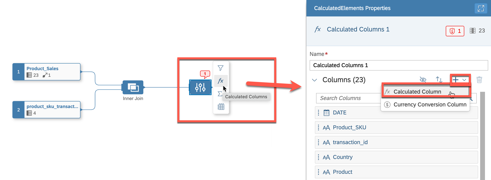
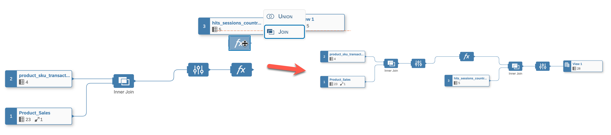

# Exercise 1- Build and expose data views on SAP Datasphere

In this exercise, your objective is to create and display data views on SAP Datasphere by utilizing predefined views from BigQuery and SAP S/4HANA. This process involves leveraging the rich data stored in BigQuery and integrating it into your SAP Datasphere for analysis and reporting purposes. At the end of the exercise, the created views will be exposed and can be accessed from SAP Analytics Cloud(SAC) to build interactive dashboards and generate valuable insights. By combining the capabilities of SAP Datasphere and SAP Analytics Cloud, you can gain a holistic view of your data, facilitating well-informed decision-making.

## Exercise 1.1- Creating a new view of "Product Sales Country"

The exercise is to build a new data view called **"Product Sales Country"** by combining and aggregating the **"Sessions Hits by Country"** and **"Product Sales"** views. This involves joining the two views to create a holistic view of the sales data and aggregating it by country to provide insights into product sales trends by location.

To achieve this, you will need to perform the following steps:

1. Create an inner join of the "Product SKU Transactions" and "Product Sales" data to combine the two views and create a comprehensive view of the sales data
   >HINT: you need to map following attributes: DATE, Product_SKU, transaction_id
2. Add a formula with a new calculated property to further enhance the insights generated from the data
   >HINT: the formula should add new column "DATESTR" which converts datatype DATE to NVARCHAR -> TO_NVARCHAR(DATE, 'YYYYMMDD')
3. Join the projection with the "Hits by Session Country" table to provide a complete picture of product sales by location
   >HINT: you need to map following attributes: Country and DAESTR/DATET
4. Create an **Association** of the final view to **Time Dimension - Day**
   >HINT: you need to map following attribute: DATE

Your goal is to navigate through these steps and create a detailed data view that effectively portrays the trends in product sales based on geographical locations. Best of luck!

### Step by Step Solution Guide

Refer to the provided solution below for a detailed, step-by-step guide on how to complete Exercise 1.

1. 👉 Open your [SAP Datasphere](https://a4d7e443-c962-4380-a0cb-53e3d6aca317.ap11.hcs.cloud.sap/dwaas-ui/index.html#/home) using the provided credentials.

      Your user is associated with unique space (TECHED_\<USER_NO>) where you can work and create your data artifacts. 

      

2. 👉 Go to SAP Datasphere Data Builder and create New Graphical View

      

3. 👉 Navigate to the **Shared Objects** from Repository, expand the views and drag and drop the following 3 views into the canvas
      - product_sku_transactions_view
      - Product_Sales
      - hits_sessions_country_view

      

4. 👉 Drag and move **product_sku_transaction_view** on top of **Product_Sales** to create a **JOIN**

      

5. 👉 Define the following **JOIN** conditions:
    
      - Join Type: *Inner*
      - Mappings (see screenshot below): DATE->DATE, Product_SKU->Product_SKU, transaction_id->transaction_id

      

6. 👉 Keep the Projection columns unchanged
   
7. 👉 Add new **Calculated Column** (see screenshot below)

      

8. 👉 The idea of the calculated column is to have an additional DATE field with *String* data type, which is required for the next join. Add the following properties to the calculated column.
      - Business Name: *DATESTR*
      - Technical Name: *DATESTR*
      - Data Type: *String*
      - Lenght: *10*
      - Expression: *TO_NVARCHAR(DATE, 'YYYYMMDD')*

      

9. 👉 Drag and move **Calculated Column** on top of **hits_session_country_view** to create the second **JOIN**
   
      

10. 👉 Define the following **JOIN** conditions:
    
      - Join Type: *Inner*
      - Mappings (see screenshot): DATESTR->DATET, Country->Country

      

11. 👉 Finalyse the view by giving a name, semantic type and expose for consumption
    
    - Business Name: *Product_Sales_Country*
    - Technical Name: *Product_Sales_Country*
    - Semantic Usage: *Fact*
    - Expose for Consumption: *On*
   
      

12. 👉 Create a new **Association**, search for the *"Time Dimension - Day"* and add it as a target.
    
      

13. 👉 Create the following mapping: **DATE->Date**
    
      

14. 👉 Save and deploy the **Product_Sales_Country** view
    
      

## Congratulations!

Congratulations on completing your Exercise 1! You have successfully created a new view of "Product Sales Country"!

Let's continue to - [Exercise 2 - Creating a new view of "Product Sales Country Discount""](../ex2/README.md)

