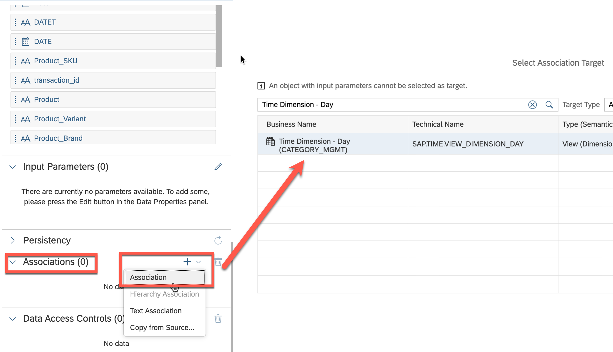
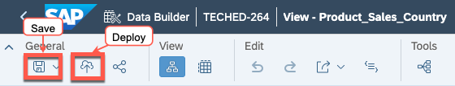

# Exercise 2- Creating a new view of "Product Sales Country Discount"
This exercise focuses on creating a new data view called **"Product Sales Country Discount"**. This view will be created by joining **"Product Sales Country"** with the **"Discount by Category Date"** view, which is federated from the SAP S/4HANA system. The purpose of this process is to combine the data from the two views to create a comprehensive view of product sales and discounts by country and date. The resulting **"Product Sales Country Discount"** view will provide valuable insights into sales trends, allowing you to make informed decisions about promotions and discounts.

To complete this exercise, you will need to follow these steps:

1. Join the "Product Sales Country" view with the "Discount by Category Date" view, using a common field such as "Date" and "category"
   >HINT: you need to create a LEFT Join
2. Identify the missing measures from the attributes and move them to measures
   >HINT: attributes: Sessions, Hits
3. Create an **Association** of the final view to **Time Dimension - Day**
   >HINT: you need to map following attribute: DATE

Your goal is to navigate through these steps and create a comprehensive data view that accurately reflects product sales and discounts by country and date. Best of luck!

### Step by Step Solution Guide

Refer to the provided solution below for a detailed, step-by-step guide on how to complete Exercise 2.

1. 👉 Go to **SAP Datasphere Data Builder** and create **New Graphical View**
    

2. 👉 Open the **Shared Objects** from Repository, expand the views and drag and drop the **"discount_by_category_date_view"** into the canvas.

3. 👉 Open the **Views** from the Repository and drop the **"Product_Sales_Country"** view into the canvas.
   
    

4. 👉 Drag and move **discount_by_category_date_view** on top of **Product_Sales_Country** to create a **JOIN**
   
    

5. 👉 Define the following **JOIN** conditions:
    
    - Join Type: *Left*
    - Mappings (see screenshot): Date->Date, Product_Category_Enhanced_Ecommerce->category
   
    

6. 👉 Keep the Projection columns unchanged

7. 👉 Finalyse the view by giving a name, semantic type and expose for consumption
    
    - Business Name: *Product_Sales_Country_Discount*
    - Technical Name: *Product_Sales_Country_Discount*
    - Semantic Usage: *Fact*
    - Expose for Consumption: *On*
   
    

8. 👉 Move **Sessions** and **Hits** attributes to **Measures**
    
    

9. 👉 Create a new **Association**, search for the *"Time Dimension - Day"* and add it as a target.
    
    

10. 👉 Create the following mapping: **DATE->Date**
    
    

11. 👉 Save and deploy the **Product_Sales_Country_Discount** view
    
    

## Congratulations!

Congratulations on completing your Exercise 2! You have successfully created a new view of "Product Sales Country Discount"!

Let's Continue to - [Exercise 3 - Creating a new analytical model for "Product Sales Country Discount"](../ex3/README.md)