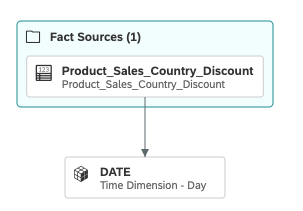
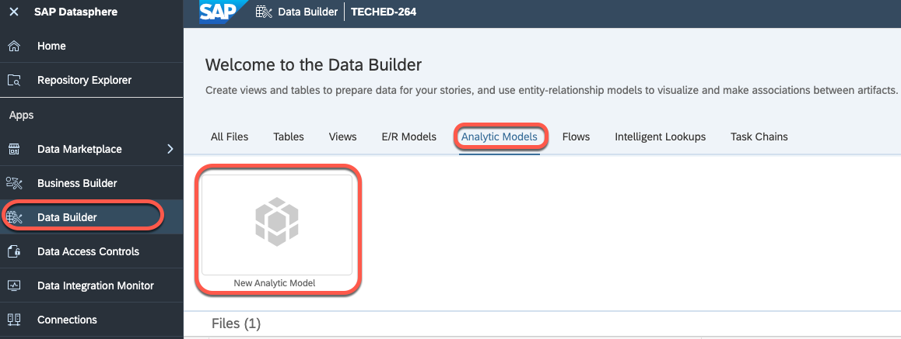
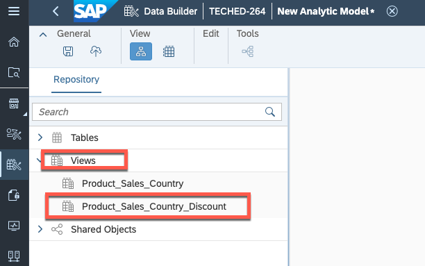
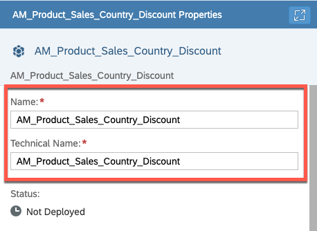
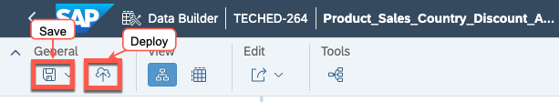

# Exercise 3- Creating a new analytical model for "Product Sales Country Discount"
This exercise focuses on creating a new analytical model called **"Product Sales Country Discount"**. This model will be created by importing **"Product Sales Country Discount"** View to expose data for visualisation in SAP Analytics Cloud.

To complete this exercise, you will need to follow these steps:
1. Import all the measures and dimensions of  **"Product Sales Country Discount"** View.

2. Finalyse the analytical model by giving a name relevant to the **"Product Sales Country Discount"** View.

Your goal is to navigate through these steps and create an analytical model for **"Product Sales Country Discount"** view that will be used for consumption. Best of luck!

### Step by Step Solution Guide

Refer to the provided solution below for a detailed, step-by-step guide on how to complete Exercise 3.

1. 👉 Go to **SAP Datasphere Data Builder** and create **New Analytical Model**

2. 👉 Open the **Views** from the Repository and drop the **"Product_Sales_Country_Discount"** view into the canvas.

      

3. 👉 In the **Select Properties To Be Copied**, check the **Add all attributes to analytic model**, **Add all measures to analytic model** and **Associated Dimensions** checkbox and Click on **Import**

4. 👉 Finalyse the analytical model by giving a name
    
    - Business Name: *AM_Product_Sales_Country_Discount*
    - Technical Name: *AM_Product_Sales_Country_Discount*

      

5. 👉 Save and deploy the **AM_Product_Sales_Country_Discount** analytical model

      

## Summary

You've now created two views and one analytical model in SAP Datashpere. The analytical model "Product Sales by Country and Discount" will be utilized by SAP Analytics Cloud to create a dashboard. This analytical model provides insights into the sales of products by country and the discounts offered, which can be used to inform strategic business decisions.

## Congratulations!

Congratulations on completing your Exercise 3! You have successfully created a new analytical model for "Product Sales Country Discount"!

Let's Continue to - [Exercise 4 - Creating the Layout for the Category Management Dashboard](../ex4/README.md)