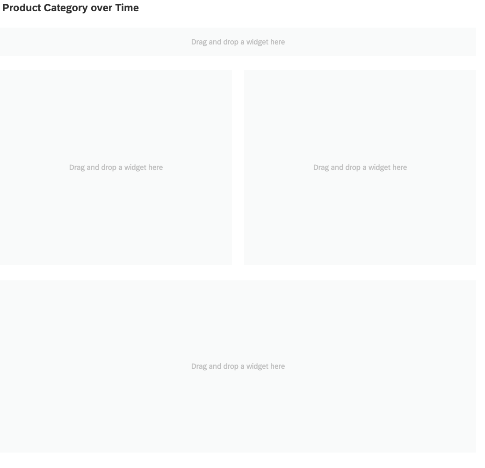
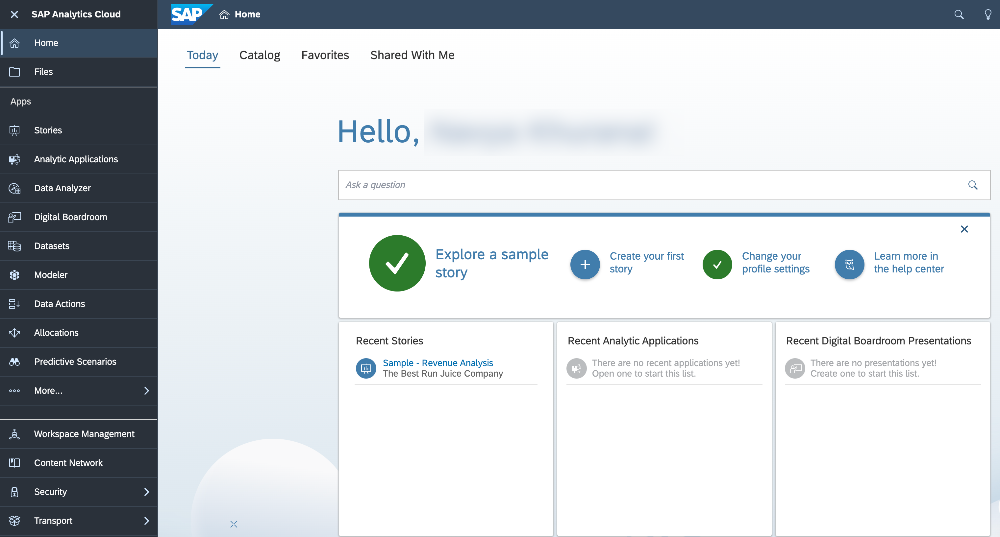
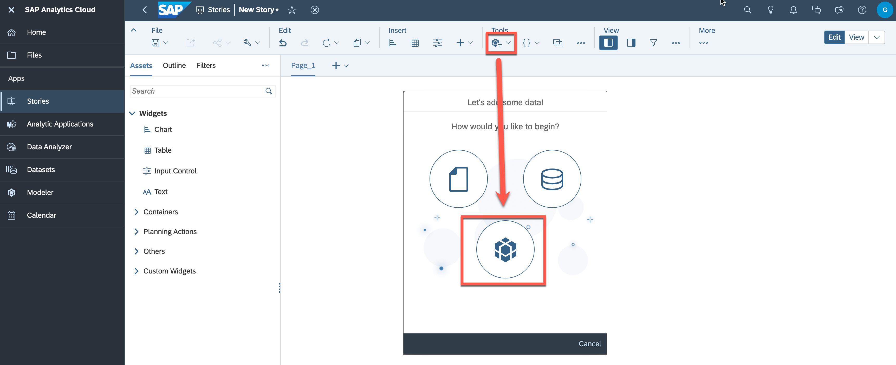
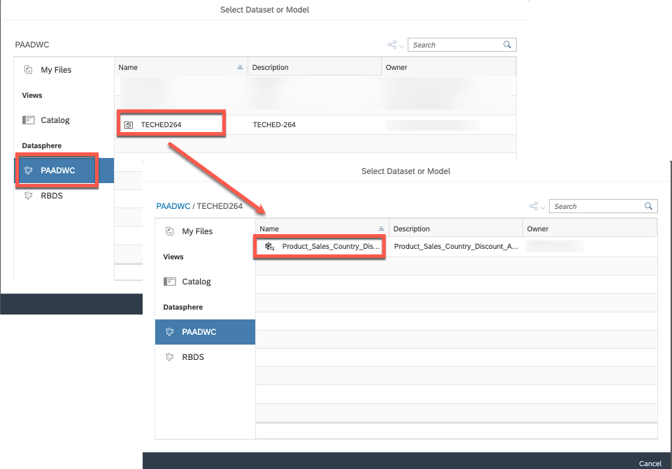

# Exercise 4 - Create a Category Management Dashboard on SAP Analytics Cloud

This exercise will focus on leveraging previously created views to create rich Category Management reports in SAP Analytics Cloud. By integrating these data sources, the reports will allow for powerful data analysis and visualization of the sales performance of different product categories. The information gathered from these reports can be used to make informed decisions about product assortment, pricing, and promotions. The use of Big Query and SAP source systems will ensure that the data used in these reports is accurate, up-to-date, and consistent, providing a solid foundation for effective Category Management decision-making.

## Exercise 4.1 Creating the Layout for the Category Management Dashboard

This exercise focuses on creating the layout for a Category Management Dashboard based on the displayed image. Determine the appropriate size and placement of each component to ensure a clear and concise presentation of the data.

  

### Step by Step Solution Guide

1. 👉 Open the [SAP Analytics Cloud](https://techedsac-da266.ap11.hcs.cloud.sap/sap/fpa/ui/app.html#/home) using the provided credentials.
   
  

2. 👉 Go to the **Stories** and create a new **Canvas**
    
    >Use the Optimized Design mode, which provides an improved experience when designing dashboards. This mode has some useful new features, but it does not include all the features that are currently supported in the Classic Design mode.
    
    

3. 👉 Drag and drop a **Text** field to give the dashboard name *"Product Category over Time"*

4. 👉 Drag and drop 4 **Panels** into the canvas to shape a layout for the charts (see the screenshot below)
 
    

## Exercise 4.2 Assigning the data from SAP Datasphere to Dashboard

This exercise focuses on adding the **"Product_Sales_Country_Discount"** view from SAP Datasphere as a data source in SAP SAC.

### Step by Step Solution Guide

1. 👉 Go to the **Tools** and press **Add new Data**, then select **Data from an existing dataset or model**
    
    

2.  👉 Select the connection **SAP Datasphere** as a source, your space and the dataset
    - Connection: **PAADWC**
    - Space: **TECHED_\<USER_NO>**
    - Dataset: **Product_Sales_Country_Discount**
  
    

## Congratulations!

Congratulations on completing your Exercise 4! You have successfully created the layout for "Category Management Dashboard" and assigned data from SAP Datasphere to Dashboard!

Let's Continue to - [Exercise 5 - Creating the Charts in Category Management Dashboard for displaying Data](../ex5/README.md)
