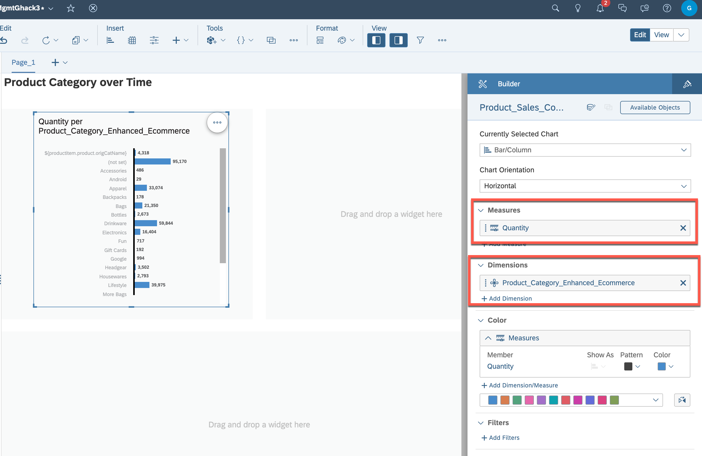
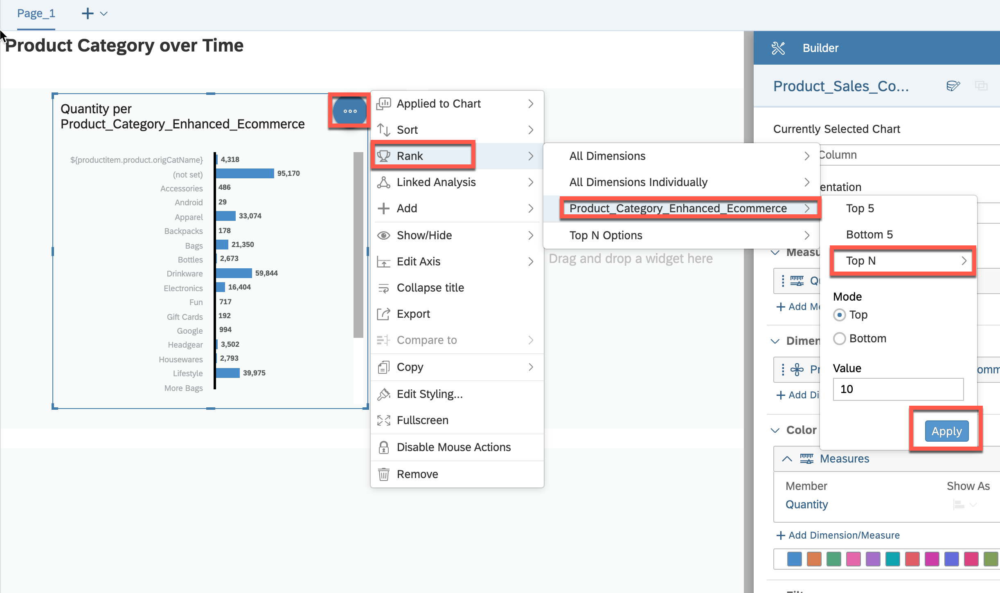
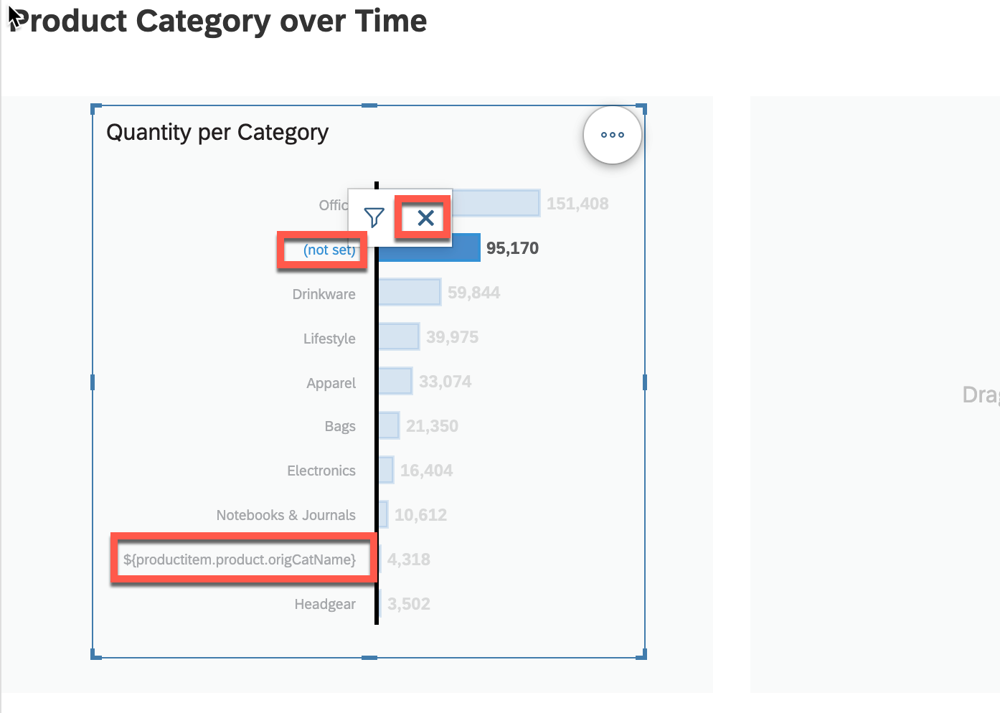
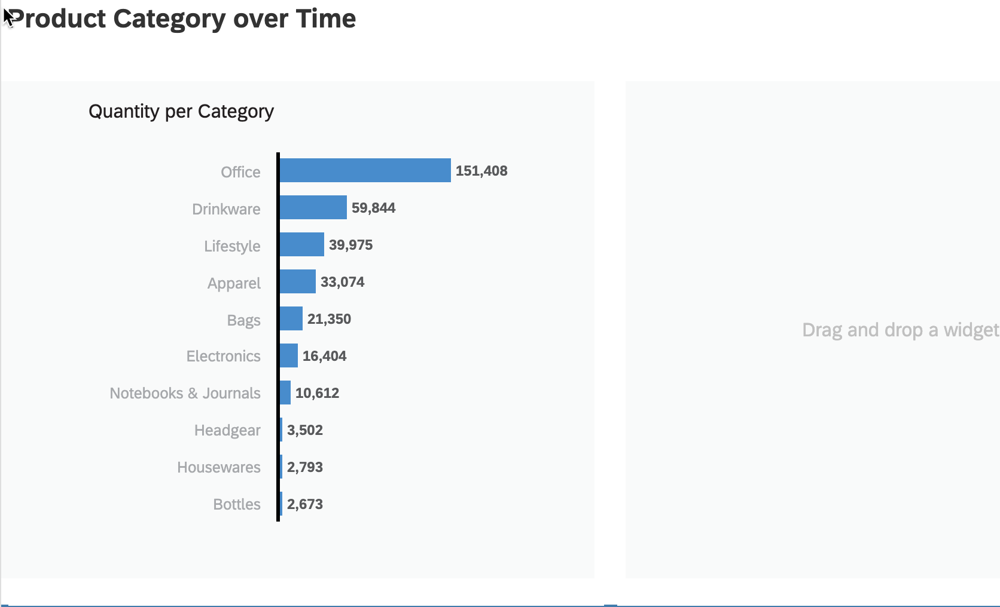
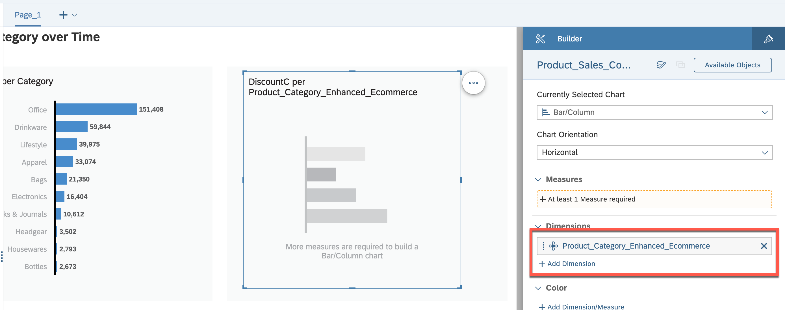
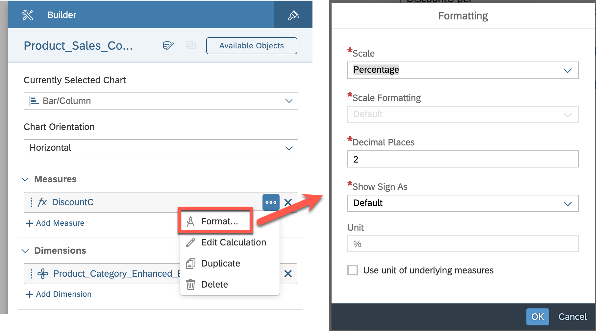
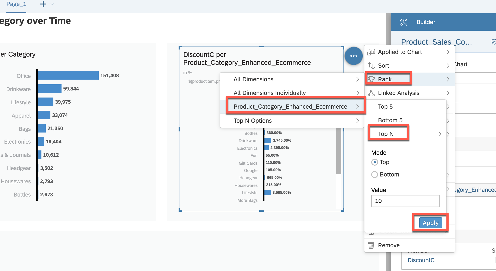
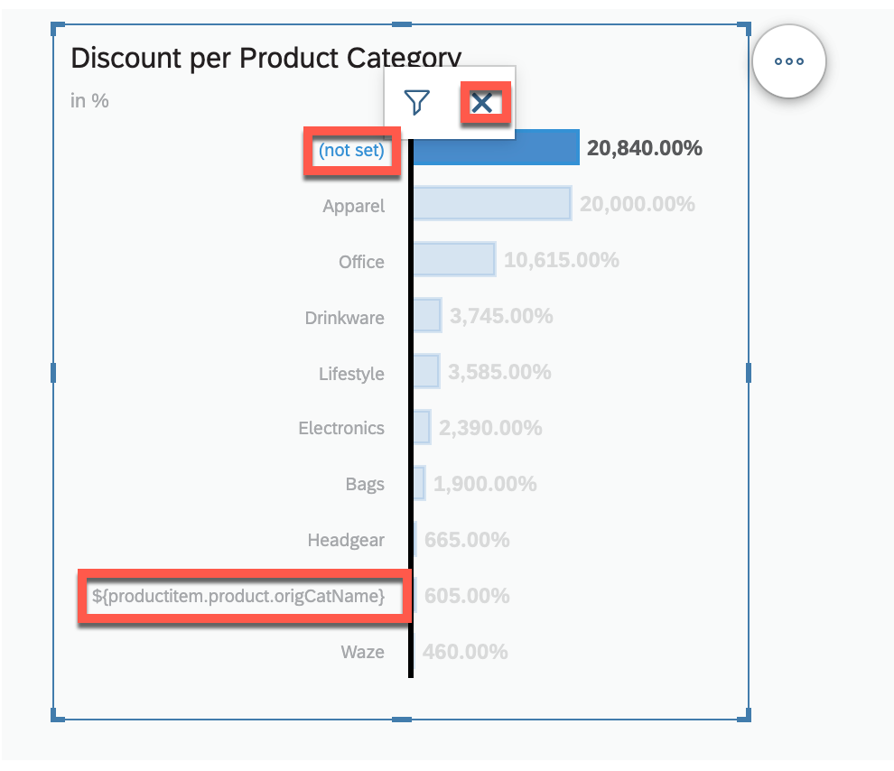
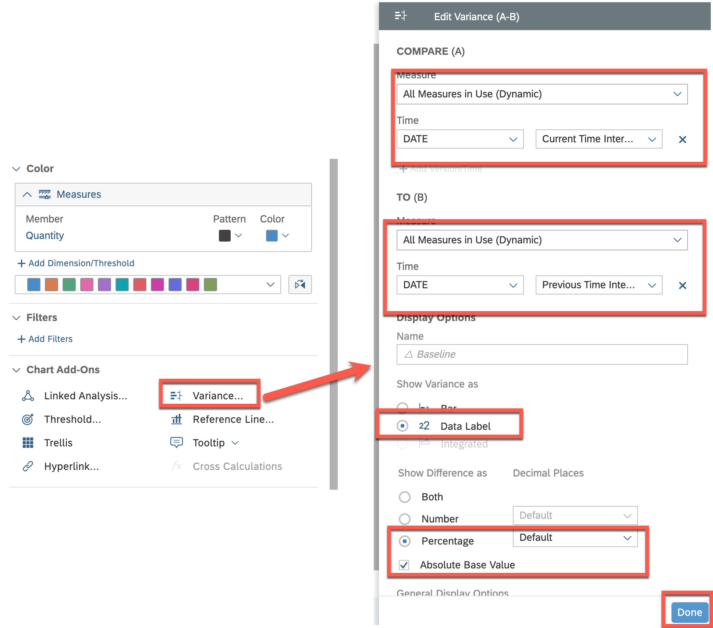

# Exercise 5- Creating the Charts in Category Management Dashboard for displaying Data

## Exercise 5.1 Creating the first Chart for displaying **Quantity per Product Category**

This exercise focuses on creating the first chart for displaying **"Quantity per Product Category"** in a dashboard. The purpose of this chart is to provide an overview of the product categories with the highest quantities sold (Top 10), allowing users to identify trends and opportunities for improvement.

To complete this exercise, you will need to follow these steps:

1. Select the appropriate chart type for displaying quantity by product category, such as a bar chart or a pie chart.
2. Choose the appropriate visualization settings, such as the color scheme, labels, and axes, to ensure that the data is easy to read and visually appealing.
3. Select the appropriate fields from the data source to display quantity by product category.
4. Configure any necessary filters or sorting options to ensure that the data is displayed accurately and in the desired order.

Your objective is to create a chart that accurately displays the quantity by product category in a clear and visually appealing way, allowing users to quickly identify trends and make informed decisions. Best of luck!

 

### Step by Step Solution Guide

After assigning the dataset, you can start building your first charts

1. 👉 Drag and drop from the left panel a **Chart** widget into the first container

   

2. 👉 Select the chart and add the following properties in a **Builder** on the right panel 
    - Measure: **Quantity**
    - Dimensions: **Product_Category_Enhanced_Ecommerce**

   

3. 👉 Click on the **...** "More Actions" and rank the **Product_Category_Enhanced_Ecommerce** as **Top 10**, to display top products per category.

   

4. 👉 Exclude the **(not set)** and **${productitem.product.origCatName}** attributes by selecting them and pressing **X**

   

5. 👉 Give some proper name ("Quantity per Product Category") and your first chart is ready

   

## Exercise 5.2 Creating another Chart for displaying **Discount per Product Category**

This exercise focuses on creating another chart for displaying **"Discount per Product Category"** in a dashboard. The purpose of this chart is to provide an overview of the product categories with the highest discounts applied, allowing users to identify trends and opportunities for improvement.

To complete this exercise, you will need to follow these steps:

1. Select the appropriate chart type for displaying quantity by product category, such as a bar chart or a pie chart.
2. Choose the appropriate visualization settings, such as the color scheme, labels, and axes, to ensure that the data is easy to read and visually appealing.
3. Select the appropriate fields from the data source to display discount by product category.
4. Configure any necessary filters or sorting options to ensure that the data is displayed accurately and in the desired order.
5. Optionally you can add a reference line for the average discount.

Your objective is to create a chart that accurately displays the discount by product category in a clear and visually appealing way, allowing users to quickly identify trends and make informed decisions. Best of luck!
 
 

### Step by Step Solution Guide

Similar to the previous approach create another chart to visualize the **Discount** per Product Category**

1. 👉 Drag and drop from the left panel a **Chart** widget into the second container

   

2. 👉 Select the chart and add the following properties in a **Builder** on the right panel 
    - Dimensions: **Product_Category_Enhanced_Ecommerce**

   

3. 👉 Add a new **Calculation** as a **Measure**
    - Type: **Calculated Measure**
    - Name: **DiscountC**
    - Formula: **["AM_Product_Sales_Country_Discount":discount]** (This will be the Analytic Model Name which you created in SAP Datashpere in Exercise 1)

   

4. 👉 Format it as a **Percentage****
    > Note: Uncheck the *Use unit of underlying measures* to activate the percentage option in Scale Dropdown

   

5. 👉 Click on the **...** "More Actions" and rank the **Product_Category_Enhanced_Ecommerce** as **Top 10**, to display top products per category.

   

6. 👉 Exclude the **(not set)** and **${productitem.product.origCatName}** attributes by selecting them and pressing **X**

   

7. 👉 Give some proper name ("Discount per Product Category") and your second chart is ready. Optionally you can add a reference line for the average discount.

   

## Exercise 5.3 Creating the last Chart for displaying **Sales Quantity over Time**

This exercise focuses on creating the last chart for displaying "Sales Quantity over Time" with the variance to the previous period in a dashboard. The purpose of this chart is to provide an overview of the sales quantities over time, allowing users to identify trends and compare them to previous periods.

To complete this exercise, you will need to follow these steps:

1. Select the appropriate chart type for displaying sales quantity over time, such as a line chart or an area chart.
2. Choose the appropriate visualization settings, such as the color scheme, labels, and axes, to ensure that the data is easy to read and visually appealing.
3. Select the appropriate fields from the data source to display sales quantity over time.
4. Configure any necessary filters or sorting options to ensure that the data is displayed accurately and in the desired order.
5. Add a comparison to the previous period by calculating the variance in sales quantity for each period.

Your objective is to create a chart that accurately displays the sales quantity over time with the variance to the previous period in a clear and visually appealing way, allowing users to quickly identify trends and make informed decisions. Good luck!

 

### Step by Step Solution Guide

1. 👉 Drag and drop from the left panel another **Chart** widget into the bottom container

   

2. 👉 Select the chart and add the following properties in a **Builder** on the right panel 
    - Currently Selected Chart: **Line**
    - Measure: **Quantity**
    - Dimensions: **DATE** and set Hierarchy to **Level 3**

   

3. 👉 Add a new **Variance** to compare the **Current Time Interval** with the **Previous Time Interval** by using the properties displayed below

   

4. 👉 Give some proper name ("Sales Quantity over Time (with variance to Previous months)") and your last chart is ready

   

## Congratulations!

Congratulations on completing your Exercise 5! You have successfully created Charts in Category Management Dashboard for displaying Data!

Let's Continue to - [Exercise 6 - Creating the Charts in Category Management Dashboard for displaying Data](../ex6/README.md)
